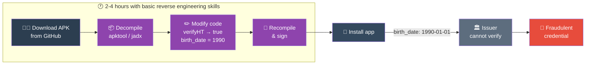

*A security analysis of the EU Age Verification Wallet reveals a privacy-first design with a critical trust gap that undermines its security guarantees.*

<!-- truncate -->

## The stakes: more than just buying alcohol

When we talk about age verification, it's easy to think of trivial use cases: buying a beer at a festival, accessing an adult website, or purchasing cigarettes. But the EU's digital identity ambitions extend far beyond these scenarios.

The [Age Verification Wallet](https://github.com/eu-digital-identity-wallet/av-app-android-wallet-ui) is a stepping stone toward the broader [EU Digital Identity Wallet](https://commission.europa.eu/strategy-and-policy/priorities-2019-2024/europe-fit-digital-age/european-digital-identity_en) - a system designed to become the digital equivalent of your physical ID card. Imagine using it to:

- Open a bank account
- Sign legal contracts
- Access healthcare records
- Vote in elections
- Prove your professional qualifications

The security of this foundation matters. A bypassable age verification system isn't just a problem for alcohol vendors - it's a warning sign for the entire digital identity infrastructure Europe is building.

## Introduction

The European Commission is building an [Age Verification (AV) Wallet](https://github.com/eu-digital-identity-wallet/av-app-android-wallet-ui) - a mobile application that allows EU citizens to prove their age using their passport, without revealing their actual birth date or identity. It's part of the broader [EU Digital Identity Wallet](https://commission.europa.eu/strategy-and-policy/priorities-2019-2024/europe-fit-digital-age/european-digital-identity_en) initiative.

The concept is compelling: scan your passport with NFC, verify you're the legitimate holder via face matching, and receive a cryptographic credential that proves "I am over 18" without revealing who you are. Privacy advocates should be pleased.

But after conducting a thorough security analysis of the [Android](https://github.com/eu-digital-identity-wallet/av-app-android-wallet-ui) and [iOS](https://github.com/eu-digital-identity-wallet/av-app-ios-wallet-ui) implementations, along with the [Python issuer service](https://github.com/eu-digital-identity-wallet/av-srv-web-issuing-avw-py), we found a fundamental architectural flaw: **the issuer has no way to verify that the passport verification actually happened**.

If this app launches in its current state, it will be trivially bypassable by anyone with basic reverse engineering skills. Let us explain why.

---

## Understanding the architecture: a tale of two worlds

Before diving into the technical details, let's understand the fundamental design of this system through a simple analogy.

Imagine you're applying for a job that requires a university degree. There are two ways to verify your qualification:

**Approach A (Trust the applicant):** You tell the employer "I have a degree" and they believe you.

**Approach B (Verify independently):** The employer contacts your university directly, or you provide an official transcript with verifiable signatures.

The EU Age Verification Wallet currently uses Approach A. The app performs all the verification on your phone, then simply tells the issuer "this person is over 18." The issuer has no way to confirm this claim independently.

This creates what security researchers call a **trust boundary violation**. The verification happens in an environment the user controls (their phone), but the result is trusted by a system that the user shouldn't be able to manipulate (the credential issuer).


The official solution architecture shows the components involved:


### The contradiction in the specifications

The [official technical specification](https://ageverification.dev/av-doc-technical-specification/docs/architecture-and-technical-specifications/) contains requirements that are mutually exclusive:

**Section 3.3.2** states:
> "Using this approach, the AVI does **not transmit any user-related personal information to the AP**."

**Section 4.3** requires:
> "An Attestation Provider **SHALL NOT issue a Proof of Age attestation before verifying the attestation subject's age** at LoA substantial or high."

These two requirements cannot both be satisfied. The Attestation Provider cannot verify the user's age at a "substantial" or "high" Level of Assurance if it receives no user-related personal information. The specification essentially mandates verification without evidence.

This isn't an implementation bug - it's an architectural contradiction baked into the requirements themselves.

---

## The illusion of privacy

The architecture makes a compelling promise: your biometric data never leaves your device, your passport details stay local, and the issuer only learns your birth date. On paper, this sounds privacy-preserving.

But privacy without security is meaningless. If anyone can forge an age credential without possessing a valid passport, then the "privacy" of the enrollment process becomes irrelevant - the entire system produces credentials that cannot be trusted.

This is a false sense of privacy. Users believe they're participating in a secure, privacy-respecting system, when in reality they're using an infrastructure that will be exploited the moment it goes live.

### The real privacy gap: no Zero-Knowledge Proofs

The more significant privacy concern isn't during enrollment - it's during **verification**. When you prove your age to a website or store, the current system reveals your credential to the Relying Party. This creates linkability: the same credential presented to multiple verifiers can potentially be correlated.

The solution is [Zero-Knowledge Proofs (ZKPs)](https://en.wikipedia.org/wiki/Zero-knowledge_proof) - cryptographic techniques that let you prove "I am over 18" without revealing your credential or any other identifying information.

The specification acknowledges this:

> "A next version of the Technical Specifications for Age Verification Solutions will include as an experimental feature the Zero-Knowledge Proof (ZKP) solution"

But ZKPs are explicitly **not implemented**. The specification states they were deferred because:

> "Adding support for these features would introduce additional complexity, which could hinder the rapid adoption of the solution."

So the EU chose speed over privacy. The current implementation uses standard mdoc presentations where Relying Parties see your actual credential - no unlinkability, no predicate proofs, no privacy-preserving verification. Every bar, website, and shop you verify your age with receives the same trackable credential.

---

## How to forge an age credential

The lack of server-side verification makes this system trivially exploitable. Here's a practical guide to the tools and techniques an attacker would use.



> **Alternative:** Use [Frida](https://frida.re/) for runtime hooking - no APK modification needed. Root the device, hook verification functions, same result.

### Method 1: App modification

**Tools required:**
- [apktool](https://apktool.org/) - Decompile and recompile Android APKs
- [jadx](https://github.com/skylot/jadx) - Decompile to readable Java/Kotlin code
- [Android Studio](https://developer.android.com/studio) - For signing the modified APK

**Attack steps:**
1. Download the APK from the Play Store or build from [source](https://github.com/eu-digital-identity-wallet/av-app-android-wallet-ui)
2. Decompile with `apktool d app.apk`
3. Locate the passport verification logic and birth date extraction
4. Modify to skip verification and return a hardcoded birth date
5. Recompile with `apktool b app -o modified.apk`
6. Sign with your own key and install
7. Request a credential - the issuer blindly trusts your claimed birth date

### Method 2: Runtime hooking

**Tools required:**
- [Frida](https://frida.re/) - Dynamic instrumentation toolkit
- A rooted Android device or jailbroken iPhone
- [Magisk](https://github.com/topjohnwu/Magisk) - For hiding root from detection

**Attack steps:**
1. Root/jailbreak the device and install Frida
2. Identify the verification functions using static analysis
3. Write Frida scripts to intercept and modify return values:

```javascript
// Hook passport verification - always return valid
Interceptor.attach(Module.findExportByName("libpassport.so", "verifyPassport"), {
    onLeave: function(retval) {
        retval.replace(1);  // Force success
    }
});

// Hook birth date extraction - return any date
Interceptor.attach(Module.findExportByName("libpassport.so", "extractBirthDate"), {
    onLeave: function(retval) {
        // Return 1990-01-01 instead of actual birth date
        Memory.writeUtf8String(retval, "1990-01-01");
    }
});
```

4. Run the unmodified app with hooks active
5. The issuer receives your forged birth date

### Method 3: Protocol-level attack

**Tools required:**
- [Postman](https://www.postman.com/) or `curl` - For crafting HTTP requests
- Basic understanding of [OpenID4VCI](https://openid.net/specs/openid-4-verifiable-credential-issuance-1_0.html)
- Any device capable of generating a key pair

**Attack steps:**
1. Study the issuer's OpenID4VCI endpoints from the [source code](https://github.com/eu-digital-identity-wallet/av-srv-web-issuing-avw-py)
2. Generate your own cryptographic key pair
3. Craft credential requests directly to the issuer API
4. Submit any birth date you want
5. Receive a valid, signed credential bound to your key

No passport required. No app required. No face matching required.

---

## Why app attestation doesn't solve this

A common response to client-side security issues is: "Just use Google Play Integrity or Apple App Attest." This fundamentally misunderstands the problem.

### What app attestation can verify

| Check | Google Play Integrity | Apple App Attest |
|-------|----------------------|------------------|
| App is unmodified | ✓ | ✓ |
| Device is not rooted/jailbroken | ✓ | ✓ |
| App was installed from official store | ✓ | ✓ |

### What app attestation cannot verify

| Check | Google Play Integrity | Apple App Attest |
|-------|----------------------|------------------|
| Passport was actually scanned | ✗ | ✗ |
| Face matching was performed | ✗ | ✗ |
| Liveness detection passed | ✗ | ✗ |
| Birth date is genuine | ✗ | ✗ |

App attestation proves the app is authentic. It does **not** prove the app did its job.

### The protocol-level bypass remains

Even with mandatory app attestation, an attacker can:
1. Use a legitimate, unmodified app on a non-rooted device
2. Intercept the network traffic between app and issuer (via a proxy on the local network)
3. Modify the `birth_date` field in transit
4. The issuer receives tampered data from an "attested" app

Or simpler: reverse-engineer the protocol and replay requests with forged data. The attestation token proves the app existed - it doesn't cryptographically bind the verification results to the credential request.

### The privacy cost

Even if app attestation could solve the security problem (it can't), it introduces significant privacy concerns:

| Platform | What the vendor learns |
|----------|----------------------|
| Google Play Integrity | App usage, timing, device fingerprint, linked to Google account |
| Apple App Attest | App usage, obfuscated device identifier |

Users of privacy-focused Android distributions like [GrapheneOS](https://grapheneos.org/) - who specifically avoid Google Play Services - would be excluded entirely.

You'd be trading one set of privacy problems for another, while still not fixing the fundamental security flaw.

---

## The technical details

### Passport verification: client-side only

The passport verification happens in [`PassportNFC.kt`](https://github.com/eu-digital-identity-wallet/av-app-android-wallet-ui/blob/main/passport-scanner/src/main/java/eu/europa/ec/passportscanner/nfc/passport/PassportNFC.kt) (Android) and uses the [JMRTD](https://jmrtd.org/) library:

```kotlin
// All verification happens locally
private fun verifyHT() { /* Hash verification */ }
private fun verifyDS() { /* Signature verification */ }
private fun verifyCS() { /* Certificate chain verification */ }
```

These checks verify:
- **Hash Table (HT)**: Data hasn't been modified
- **Document Signature (DS)**: Issuing authority signed the document
- **Certificate Chain (CS)**: Certificate chains to a trusted CSCA

All of this is good cryptography. But the results never leave the device in a verifiable form.

### Face verification: easily bypassable

The face matching uses a native SDK with thresholds configured in [`WalletCoreConfigImpl.kt`](https://github.com/eu-digital-identity-wallet/av-app-android-wallet-ui/blob/main/core-logic/src/dev/java/eu/europa/ec/corelogic/config/WalletCoreConfigImpl.kt):

```kotlin
faceMatchConfig = FaceMatchConfig(
    livenessThreshold = 0.972017,  // 97.2% confidence required
    matchingThreshold = 0.5        // 50% similarity required
)
```

The 97.2% liveness threshold sounds strict, but it doesn't matter if an attacker can simply hook the result:

```javascript
// Frida script to bypass face verification
Interceptor.attach(Module.findExportByName("libavfacelib.so", "jni_match"), {
    onLeave: function(retval) {
        retval.replace(1);  // Always return "match successful"
    }
});
```

### The issuer has no defense

Looking at [`formatter_func.py`](https://github.com/eu-digital-identity-wallet/av-srv-web-issuing-avw-py/blob/main/app/formatter_func.py) in the issuer service, we can see it simply accepts the birth date and creates a credential:

```python
def mdocFormatter(data, credential_metadata, country, device_publickey):
    # No verification of passport authenticity
    # Just trusts the data and signs a credential
    mdoci.new(
        doctype="eu.europa.ec.av.1",
        data=data,  # Trusts this completely
        devicekeyinfo=device_publickey,
        ...
    )
```

### The underground economy of fake IDs goes digital

To understand why this matters, consider the existing market for fake identity documents. In 2024, Europol reported seizing over 12,000 fraudulent identity documents in a single operation. The demand is enormous: from underage alcohol purchases to organized crime using false identities for money laundering.

A physical fake ID requires:
- Access to specialized printing equipment
- Knowledge of security features (holograms, UV markings, microprinting)
- Physical materials that are often controlled
- Distribution networks that risk detection

A bypassed digital credential requires:
- A laptop
- Basic programming knowledge
- The publicly available source code
- A few hours of work

The economics shift dramatically in favor of fraud. Once someone publishes a working bypass, it can be shared globally in seconds. There's no physical manufacturing bottleneck, no shipping logistics, no risk of interception.

---

## What would actually work

### The fix: server-side passport verification

The issuer needs **cryptographic proof** that a real passport was scanned. Here's what should be sent:

```kotlin
data class PassportProof(
    val sodFile: ByteArray,      // Security Object Document
    val dsCertificate: ByteArray, // Document Signing Certificate
    val dg1Bytes: ByteArray,      // Raw DG1 data (includes birth date)
)
```

The issuer would then:
1. **Verify SOD signature** with the DS certificate
2. **Verify certificate chain** against known CSCAs (Country Signing CAs)
3. **Hash DG1** and compare to the hash in SOD
4. **Extract birth date** from the now-verified DG1

This way, a modified app **cannot** forge a valid passport proof - it would need to forge the passport's cryptographic signatures, which is infeasible.

### The tradeoff: privacy vs security

Here's the tension:

| Approach | Privacy | Security |
|----------|---------|----------|
| Current (all on-device) | Excellent | Weak |
| Server-side passport verification | Reduced (nationality revealed) | Strong |

Sending SOD + DS certificate to the server reveals:
- Your nationality (from the certificate)
- That you have a valid passport

It does NOT reveal your name, passport number, or face image.

The recommendation: **verify and discard**. The issuer verifies the cryptographic proof, extracts the birth date, and immediately discards the passport data without storing it.

---

## The bigger picture

This isn't just about age verification. The [EU Digital Identity Wallet](https://github.com/eu-digital-identity-wallet) is intended to become a cornerstone of digital identity in Europe - used for everything from opening bank accounts to accessing government services.

If the architecture trusts the app to honestly report verification results, the entire system's security depends on the assumption that no one will modify the app. In 2025, that's not a reasonable assumption.

The cryptographic building blocks are all there:
- Passports have digital signatures (ICAO 9303)
- The SOD contains verifiable hashes
- Certificate chains can be validated
- [OpenID4VCI](https://openid.net/specs/openid-4-verifiable-credential-issuance-1_0.html) supports proof mechanisms

The app just needs to **use** them in a way the issuer can verify.

---

## Who should be worried?

### Businesses relying on age verification

If you're a business planning to accept EU Age Verification credentials - an online gambling platform, alcohol delivery service, or adult content provider - you need to understand what you're actually getting.

A credential from the current system means: *"Someone using the official app (or a modified version of it) submitted this birth date."*

It does **not** mean: *"This person proved their age using a verified passport."*

The liability implications are significant. If a minor obtains alcohol using a fraudulently obtained credential, who bears responsibility? The credential issuer who trusted the app? The business who trusted the credential? The platform provider who didn't implement additional checks?

### Governments and regulators

The [eIDAS 2.0 regulation](https://digital-strategy.ec.europa.eu/en/policies/eidas-regulation) mandates that EU member states offer digital identity wallets to citizens by 2026. These wallets will be used for accessing public services, signing documents, and proving identity across borders.

If the foundational age verification component is architecturally flawed, what does that suggest about the broader technical oversight? This isn't a criticism of individual developers - the code shows thoughtful privacy engineering. It's a systems-level concern about how security requirements are specified and verified in large government technology projects.

### Privacy advocates

Here's an uncomfortable truth: fixing the security vulnerability likely requires compromising some privacy guarantees.

The most robust fix - sending passport cryptographic proofs to the server - reveals your nationality. This is a meaningful privacy reduction compared to the current design where only your birth date leaves your device.

This creates a genuine tension. The privacy-first design is insecure. The secure design is less private. There may not be a perfect solution, only tradeoffs that need to be made transparently and with informed consent from citizens.

---

## How Yivi solved this problem

The security issues we've identified aren't theoretical - they're well-known in the digital identity community. The [Yivi wallet](https://yivi.app) (formerly IRMA) has already implemented passport-based credentials with a fundamentally different architecture that addresses these exact vulnerabilities.

### Server-side passport validation

Yivi's [go-passport-issuer](https://github.com/privacybydesign/go-passport-issuer) validates passport data on the server, not in the app. When a user scans their passport, the cryptographic proof is sent to the issuer for verification.

The issuer performs:
1. **Passive Authentication (PA)**: Verifies the passport's digital signatures against the Document Signing Certificate, then validates the certificate chain against government-issued Masterlists
2. **Active Authentication (AA)**: Performs a challenge-response with the passport's NFC chip to prove the physical document is present - not just a copy of its data

This means a modified app **cannot** forge credentials. Even if an attacker controls the entire app, they cannot produce valid cryptographic signatures from a passport they don't possess.

### Zero-Knowledge Proofs with Idemix

While the EU Age Verification system deferred ZKPs as "too complex," Yivi has shipped them. Using [Idemix credentials](https://privacybydesign.foundation/irma-explanation/), Yivi enables:

- **Unlinkable disclosures**: Each presentation is cryptographically unlinkable to previous ones
- **Predicate proofs**: Prove "I am over 18" without revealing your birth date
- **Selective disclosure**: Share only the attributes needed for each transaction

This is what privacy-preserving age verification actually looks like.

### The architectural difference

| Component | EU Age Verification | Yivi |
|-----------|---------------------|------|
| Passport signature verification | Client-side only | **Server-side** |
| Masterlist validation | Not implemented | **Government masterlists** |
| Active Authentication | Not used | **Challenge-response with chip** |
| Zero-Knowledge Proofs | "Future experimental feature" | **Shipped (Idemix)** |
| Credential format | mdoc (linkable) | **Idemix (unlinkable)** or SD-JWT VC |
| Protocol | OpenID4VCI | **OpenID4VP + IRMA protocol** |

### Open source and battle-tested

All Yivi components are open source and have been in production for years:

- [irmamobile](https://github.com/privacybydesign/irmamobile) - The Yivi wallet app
- [go-passport-issuer](https://github.com/privacybydesign/go-passport-issuer) - Server-side passport validation API
- [vcmrtd](https://github.com/privacybydesign/vcmrtd) - Example app for scanning and reading passports

The passport credential feature has been [publicly available since 2025](/blog/2025-passport-callout), with support for passports, ID-cards, and driver's licenses validated against Dutch and German government Masterlists.

---

## Conclusion

**Member states cannot adopt the EU Age Verification Wallet in its current form.** The architectural flaws we've documented aren't edge cases - they're fundamental. Any system that relies on client-side verification without cryptographic proof to the server will be bypassed within days of deployment. The tools are freely available, the attack vectors are well-documented, and the incentives for fraud are enormous.

This isn't speculation. It's how mobile security works.

### The JMRTD problem

The EU Age Verification app relies on [JMRTD](https://jmrtd.org/) for passport reading - a library that is poorly maintained and hasn't kept pace with the evolving landscape of Machine Readable Travel Documents. Security vulnerabilities go unpatched, compatibility issues with newer passport formats persist, and the project lacks the active development needed for critical infrastructure.

### Yivi offers a working alternative

Member states looking for a secure, privacy-preserving age verification solution can adopt [Yivi](https://yivi.app) today. We maintain production-ready MRTD infrastructure that:

- **Supports all EU countries** - validated against government-issued Masterlists
- **Is actively maintained** - security updates, compatibility fixes, and new features ship regularly
- **Implements proper security** - server-side validation with Passive and Active Authentication
- **Delivers real privacy** - Zero-Knowledge Proofs via Idemix for unlinkable disclosures
- **Is fully open source** - auditable, extensible, and free from vendor lock-in

The passport credential feature has been in production since 2025, supporting passports, ID-cards, and driver's licenses. The infrastructure exists. The code is battle-tested. Member states don't need to wait for the EU to fix its architecture - they can deploy a working solution now.

Digital identity infrastructure, once deployed at scale, becomes extremely difficult to change. The decisions made now will echo for decades. We urge member states to choose security over expediency.

---

## A note on responsible disclosure

This analysis is based entirely on publicly available source code published on GitHub by the EU Digital Identity Wallet project. The repositories are open for review, which is commendable - transparency in government technology builds trust and enables community oversight.

We've chosen to publish this analysis publicly for several reasons:

1. **The code is already public.** Anyone with security expertise can identify these issues by reviewing the repositories. Publishing an analysis doesn't reveal anything that isn't already accessible.

2. **Time pressure matters.** According to EU timelines, member states should offer digital wallets by 2026. If fundamental architectural issues aren't addressed before deployment, they become much harder to fix afterward.

3. **Public scrutiny improves security.** The security community has a long history of improving software through open analysis. The goal isn't to embarrass the development team, but to help build a more robust system.

4. **Citizens deserve to understand the systems that affect them.** Digital identity infrastructure will become a critical part of European civic life. Transparency about its security properties is a public interest matter.

We hope the EU Digital Identity Wallet team views this analysis as constructive input. The architectural changes recommended here are well within their capabilities to implement - the cryptographic building blocks already exist in the codebase.

---

## What you can do

**If you're a security researcher:** Review the code yourself. File issues on the GitHub repositories. The more eyes on this codebase, the better.

**If you're a policymaker:** Ask questions about the security review process for government digital identity projects. Ensure that independent security audits are part of the deployment requirements.

**If you're a citizen:** Be aware that digital identity credentials, like physical documents, can potentially be forged if systems aren't properly designed. Ask questions about how the credentials you're asked to trust are verified.

**If you're a business:** Don't assume that any digital credential provides absolute assurance. Understand the verification chain and implement additional checks where the stakes are high.

---

## References

### EU Age Verification
- [AV Android Wallet (GitHub)](https://github.com/eu-digital-identity-wallet/av-app-android-wallet-ui)
- [AV iOS Wallet (GitHub)](https://github.com/eu-digital-identity-wallet/av-app-ios-wallet-ui)
- [AV Issuer Service (GitHub)](https://github.com/eu-digital-identity-wallet/av-srv-web-issuing-avw-py)
- [AV Technical Specification](https://ageverification.dev/av-doc-technical-specification/docs/architecture-and-technical-specifications/)
- [EUDI Wallet Core Library](https://github.com/eu-digital-identity-wallet/eudi-lib-android-wallet-core)
- [EU Digital Identity Wallet Initiative](https://commission.europa.eu/strategy-and-policy/priorities-2019-2024/europe-fit-digital-age/european-digital-identity_en)

### Yivi / IRMA
- [Yivi Wallet (irmamobile)](https://github.com/privacybydesign/irmamobile)
- [Go Passport Issuer](https://github.com/privacybydesign/go-passport-issuer) - Server-side passport validation
- [vcmrtd](https://github.com/privacybydesign/vcmrtd) - Passport scanning library
- [Idemix Explanation](https://privacybydesign.foundation/irma-explanation/) - Zero-Knowledge Proof credentials
- [Yivi Passport Credentials Announcement](/blog/2025-passport-callout)

### Standards & Tools
- [ICAO 9303 - Machine Readable Travel Documents](https://www.icao.int/publications/pages/publication.aspx?docnum=9303)
- [OpenID4VCI Specification](https://openid.net/specs/openid-4-verifiable-credential-issuance-1_0.html)
- [OpenID4VP Specification](https://openid.net/specs/openid-4-verifiable-presentations-1_0.html)
- [JMRTD - Java Machine Readable Travel Documents](https://jmrtd.org/)

### Security Tools
- [Frida - Dynamic Instrumentation Toolkit](https://frida.re/)
- [apktool - APK Decompiler](https://apktool.org/)
- [jadx - Dex to Java Decompiler](https://github.com/skylot/jadx)
- [Magisk - Root Management](https://github.com/topjohnwu/Magisk)

### Platform Security
- [Google Play Integrity API](https://developer.android.com/google/play/integrity)
- [Apple App Attest](https://developer.apple.com/documentation/devicecheck/establishing_your_app_s_integrity)

---

*This analysis is based on the publicly available source code as of March 2026. The findings are intended to help improve the security of the EU Digital Identity ecosystem.*
