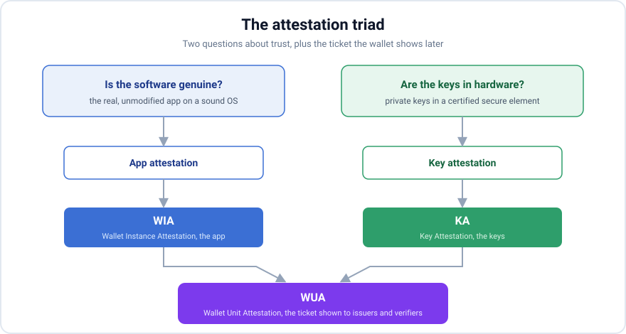
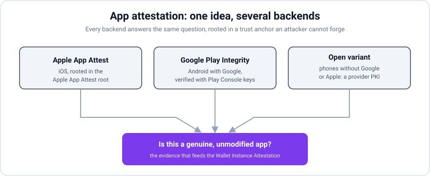
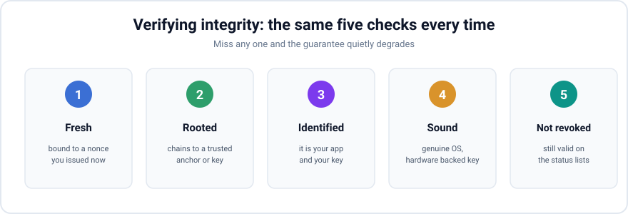
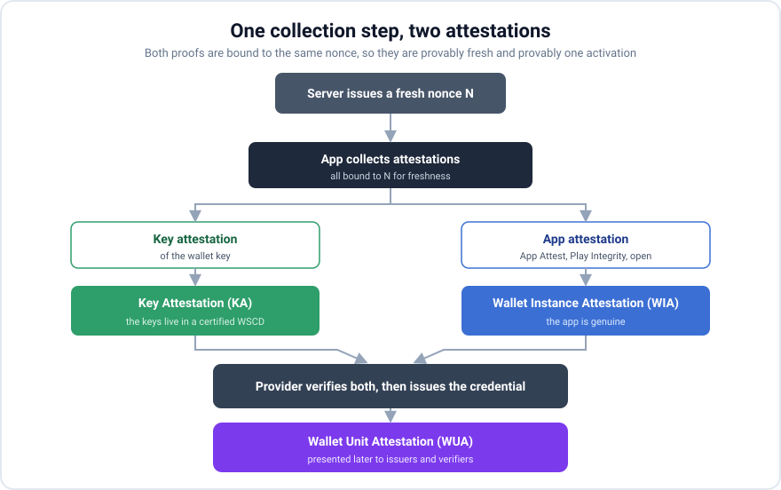

*A field guide to the attestation triad behind a Level of Assurance High wallet, WIA, WUA and key attestation, why the EU Age Verification App failed exactly here, and how app attestation closes the gap.*

<!-- truncate -->

## The news: a reference wallet that could not vouch for itself

In April 2026 the European Commission published the source code for its **[Age Verification App](https://ageverification.dev/)**, a white label reference wallet meant to show member states how to build privacy preserving age checks for the Digital Services Act. It was positioned as a blueprint for the wider EU Digital Identity Wallet program.

Within days it went badly wrong. A security researcher [reset the app PIN and disabled biometric login in **under two minutes**](https://blog.mean.ceo/the-eu-age-verification-app/), simply by editing a plain text preferences file on an Android device: delete the encrypted PIN entries, flip a boolean to turn off biometrics, and the stored credentials were still there for the taking. [Another researcher then reproduced the work](https://idtechwire.com/researcher-finds-security-flaws-in-eu-age-verification-app/) and documented several more issues, including personal data stored without encryption.

The PIN reset made the headlines, but the deeper finding is the one that matters here. The system **could not confirm that the age check had actually happened on a genuine, unmodified app**. A tampered build could intercept its own data flow, submit a fabricated birth date, and the issuer would still hand back a perfectly valid age credential. Every signature was real. Every attestation was real. The adult really was over eighteen. And the system could still be fooled, because nothing bound the credential to *a genuine app running on sound hardware, operated by the person in front of it*.

That is the question this post is about:

> **How does a wallet provider know that the app talking to it is genuine, and that trustworthy hardware and a trustworthy provider stand behind it?**

You cannot answer this by asking the app, because a malicious app lies. You answer it with **attestation**: cryptographic evidence, rooted in a platform or manufacturer trust anchor an attacker cannot forge, that the app and its keys really are what they claim to be. The ARF turns this into three named obligations. Let us walk through them, then through the two mechanisms that feed them, and finally back to what the age verification app was missing.

## Two questions, and the attestation triad

Strip everything down and there are two independent questions:

1. **Is the software genuine?** Is this the real, unmodified wallet on an operating system that has not been tampered with?
2. **Are the keys really in hardware?** Are the private keys held in a certified secure element, so the user keeps control and nobody can clone them?

They are independent, and it is worth seeing why, because the natural objection is *surely a genuine app implies genuine keys?* It does not. App attestation certifies the **code**, not the runtime outcome. A genuine, unmodified build can *ask* the platform for a hardware key and still be handed a software or TEE key when the device has no certified secure element, an older phone, some OEM builds, an emulator, and the binary is none the wiser. On iOS the split is unavoidable: the Secure Enclave holds the key but hands your server no certificate proving it, so even a perfectly genuine app cannot self-certify where its key lives. That is exactly what key attestation reports independently, rooted in the manufacturer's hardware trust anchor rather than in the app's identity. The reverse fails too: a cloned app can talk to real hardware. So you need evidence for both. The ARF names three attestations that map onto those questions plus one more for presentation.

A short way to hold it in your head:

> **WIA is about the app. KA is about the keys. WUA is the ticket the wallet later shows to issuers and relying parties**, and that ticket is trustworthy precisely because the provider checked the WIA and the KA up front.

| Attestation | What it attests | Which question | Signed by |
|---|---|---|---|
| **WIA**, Wallet Instance Attestation | the integrity and authenticity of the app on the device, plus a revocation reference | Is the software genuine? | Wallet Provider |
| **KA**, Key Attestation | that a certified secure element manages the wallet keys, and lists their public keys | Are the keys in hardware? | Wallet Provider |
| **WUA**, Wallet Unit Attestation | a presentable proof the wallet is genuine, with its Level of Assurance and non revocation status | Can a third party trust it later? | Wallet Provider |

The crucial point: the **WIA is fed by app attestation**, and the **KA is fed by key attestation**. Both can be collected in the same step at activation, bound to the same server nonce. Get that step right and the age verification failure does not happen. Skip it, and a tampered app can talk to your issuer with a straight face.

## Key attestation: proving a key lives in hardware

Key attestation answers question two. The secure element generates a key and then hands you a manufacturer signed statement: this key was created inside me, it has never left, and here are its properties.

On **Android** you generate a key in the Keystore and pass an attestation challenge, a server nonce N. The device returns an X.509 certificate chain, from the leaf up to a hardware attestation root published by the platform vendor. A dedicated extension on the leaf tells you the security level (a dedicated secure element, a trusted execution environment, or plain software), whether the key was born in hardware and never imported, the challenge it was bound to, the verified boot state, and even the calling app identity. To verify you check every link in the chain, anchor it in the vendor root, confirm the leaf public key equals the key being registered, confirm the challenge equals N, read the security level, and check the leaf is not on the vendor revocation list.

On **iOS** it is different. The Secure Enclave will happily hold a key and sign with it, and the private key never leaves the chip, but the platform gives you no certificate chain proving that to a server. On iOS the app level mechanism, App Attest, is what carries a hardware rooted proof to your backend. That asymmetry is one reason app attestation matters so much.

## App attestation: proving the app is genuine

App attestation answers question one, and this is the piece the age verification app was missing. Each mechanism produces evidence, rooted in the platform vendor, that this specific build of your app is running unmodified on a genuine operating system.

**Apple App Attest.** The OS gives your app a hardware managed key and an attestation for it, delivered as a signed object whose certificate chain roots in an Apple trust anchor. Your server checks that the chain anchors in Apple's root, that the attestation is bound to your challenge, that the key identifier matches the public key, that the app identity equals your Team and bundle, and that the environment is production rather than development. Apple also offers cheap **assertions** for proving liveness on later requests, so the intent is to attest once at registration and assert per use.

**Google Play Integrity.** The app requests an integrity token bound to your nonce. In the on device flow the token is a signed and encrypted object that you can decrypt and verify entirely on your own infrastructure with keys the Google Play Console gives you, with no callback to Google. You then read a verdict that says whether Google recognizes this exact build and signing certificate, whether the device meets an integrity bar, and whether the echoed nonce matches yours.

**The gap the ARF cares about: phones without Google or Apple.** Apple App Attest needs Apple, and Play Integrity needs Google services. A wallet running on GrapheneOS, CalyxOS or /e/OS, or installed from an independent Android distribution, has neither. For a sovereign European identity wallet those are not edge cases, they are requirements. This is also why the ARF speaks of a **WIA** rather than of App Attest or Play Integrity. It separates two things that are easy to conflate:

* **The WIA is always issued by the wallet provider.** On every platform, Apple, Google, or an open one, the provider is the party that verifies the evidence and then signs the WIA, runs the certificate authority behind it, and keeps the status list that lets it revoke a wallet later. This provider PKI is not an alternative to App Attest or Play Integrity, it is the issuance layer that sits on top of all of them.
* **What varies is the source of evidence the provider checks before it signs.** App Attest supplies that evidence via Apple, Play Integrity via Google, and both are simply unavailable on a de-Googled phone. So the real question for a sovereign wallet is whether an *open* source of evidence exists. It does.

The open source of evidence is **Android's standard hardware key attestation**, and it needs no store at all. The key attestation extension names the calling package and its signing certificate, and it reports a `verifiedBootState`, `Verified` for a stock OS, `SelfSigned` for an aftermarket OS running under a locked bootloader with its own verified boot key, together with that boot key's hash as the root of trust, all anchored in the manufacturer's hardware root rather than in a store. A verifier accepts `SelfSigned` when the reported boot key matches an approved fingerprint on a pinned list. GrapheneOS makes this concrete by publishing its official verified boot key fingerprints in a signed list at [`grapheneos.org/attestation.json`](https://grapheneos.org/articles/attestation-compatibility-guide), so the wallet provider's backend can pin those keys and recognise a genuine GrapheneOS device with no Google dependency, a stronger and more transparent signal than Play Integrity's pass/fail verdict. The pinning and the chain check must live on the provider's verifier, not in the app, for the same reason the rest of this post keeps repeating: a tampered app would simply skip a check it runs on itself. The caveat is that this only works where the platform ships a real hardware-backed keystore *and* a relockable bootloader with a published key: GrapheneOS and CalyxOS qualify, whereas /e/OS ships [microG](https://doc.e.foundation/support-topics/guide-micro-g) and can only relock the bootloader on [a small set of official-build devices](https://community.e.foundation/t/list-devices-where-bootloader-can-be-relocked/48424), around a dozen Fairphone, Pixel and Murena-sold models, while most devices run community builds that cannot relock and therefore report `Unverified`, which weakens the guarantee, so coverage has to be checked per distribution rather than assumed.

Whichever source it used, the provider then wraps that evidence into the WIA it issues and signs. What it must never do is accept a bare software secret as the evidence: an attestation key that merely ships inside the app binary with no hardware root degrades to a shared secret an attacker can extract from a tampered build and replay, which is no proof of integrity at all. The evidence has to be anchored in hardware; the provider PKI only names and revokes the result.

## How to verify integrity: one recipe for every scheme

Whatever the backend, verification follows the same five checks. Internalize this and every scheme looks alike.

1. **Fresh.** The evidence must cover a random nonce you issued this session, otherwise an attacker replays a genuine attestation captured once.
2. **Rooted.** The evidence must chain to something unforgeable, a vendor root or a key you obtained out of band.
3. **Identified.** It must be your app and your key, not merely some genuine app and some genuine key.
4. **Sound.** The environment must be healthy, a genuine OS with a hardware backed key and locked verified boot.
5. **Not revoked.** The key or attestation must still be valid on the relevant status lists.

Miss any one and the guarantee quietly degrades. Skip freshness and you accept replays. Skip identity and a different genuine app passes. Skip revocation and a known compromised key sails through. The age verification app effectively skipped freshness and identity at the point where it mattered, which is why a forged payload from a modified app was accepted as genuine.

## Putting it together: one collection step, two attestations

Here is the payoff. During activation the app performs a single attestation collection step against the server nonce, and it produces evidence for both questions at once.

* The **key attestation of the device key** feeds the **KA**: the provider issues a certificate that lists the wallet public keys and states that a certified secure element holds their private counterparts.
* The **app attestation** feeds the **WIA**, the provider verdict that the app binary is genuine.
* Both are bound to the same nonce, so they are provably fresh and provably part of the same activation.
* Later, when the wallet presents itself to an issuer or a relying party, it shows a **WUA** and proves that it controls the key by signing a challenge. The WUA is trustworthy exactly because the provider checked the WIA and the KA at onboarding, and because a status list lets the provider revoke it.

This is the structure the age verification app lacked. There was no strong binding tying the credential to a genuine, unmodified app on attested hardware, so a tampered build could obtain a valid credential. Add the collection step above, bind the issued credential to the WIA and the KA, and a tampered build simply cannot get a credential, because it cannot produce a genuine app attestation over the issuer nonce.

Two design choices come with this:

* **Advisory or blocking.** You can record the verdict without refusing activation, or reject when the app is not proven genuine. A pilot usually starts advisory, so a rollout gap or a device without Google services is not locked out, then tightens to blocking per platform once coverage is understood.
* **Once or every time.** Full attestation is a registration time operation. The Apple attestation call is single use per key, and Play Integrity tokens are quota limited. So attest once at activation, and if you need freshness per action use the tools built for it, App Attest assertions and Play Integrity standard tokens, which are cheap and meant for frequency. Do not re run full attestation on every signature.

## Practical pitfalls

* **Simulators and emulators do not attest.** App Attest is unsupported on the iOS Simulator, and Android emulators usually fail device integrity. Test on real hardware.
* **Recognition needs distribution.** A locally sideloaded Android build is not recognized by the store. Device integrity still works, but app recognition requires the build to come from Google Play, and a private internal testing track is enough.
* **Nonce encoding is a real source of bugs.** Agree on exactly one encoding on both ends.
* **Roots rotate.** Vendors rotate their hardware attestation roots, so fetch them live and keep an embedded fallback.
* **Attestation is not authorization.** It tells you the app and the keys are genuine. It does not replace the user knowledge factor, the PIN, or the proof that the wallet controls its key. Layer all three. The age verification app is a case study in what happens when the layers are thin.

## Conclusion

The ARF triad is not paperwork. It is the answer to "why should I believe this wallet" broken into three checkable claims:

* **WIA**, the app is genuine, fed by app attestation, whether Apple App Attest, Google Play Integrity, or an open variant for phones without Google or Apple services;
* **KA**, the keys live in a certified secure element, fed by key attestation;
* **WUA**, a presentable and revocable ticket the wallet shows downstream, trustworthy because the provider verified the other two.

The EU Age Verification App is the cautionary tale. It shipped real signatures and real attestations, yet it could still be fooled, because it never firmly answered the one question that matters: is the thing making this request a genuine app, on sound hardware, backed by a provider I trust? App attestation is the piece that closes the software half of that answer, and treating it as a pluggable capability rather than as whatever Apple and Google happen to offer is what lets a European wallet serve independent Android distributions as first class citizens. Get the five checks right, fresh, rooted, identified, sound and not revoked, and every scheme slots into the same frame.

## Sources

* [Experts slam EU age verification app after easy 2 minute bypass, Cybernews](https://cybernews.com/security/eu-age-verification-app-hack/)
* [Researcher finds security flaws in EU Age Verification App, ID Tech Wire](https://idtechwire.com/researcher-finds-security-flaws-in-eu-age-verification-app/)
* [The EU Age Verification App got hacked in 2 minutes, mean.ceo](https://blog.mean.ceo/the-eu-age-verification-app/)
* [EU Age App hacked in 2 minutes and EUDI Wallet impact, Gataca](https://www.gataca.io/resources/blog/eu-age-verification-app-hacked-eudi-wallet/)
* [If the European Age Verification app launches today, it will be broken tomorrow, Yivi docs](https://docs.yivi.app/blog/eu-age-verification-security-analysis/)
* [EU Age Verification Blueprint, technical portal](https://ageverification.dev/)
* [Attestation compatibility guide, GrapheneOS](https://grapheneos.org/articles/attestation-compatibility-guide)
* [A simple guide to understand microG, /e/OS documentation](https://doc.e.foundation/support-topics/guide-micro-g)
* [List: devices where the bootloader can be relocked, /e/OS community](https://community.e.foundation/t/list-devices-where-bootloader-can-be-relocked/48424)
