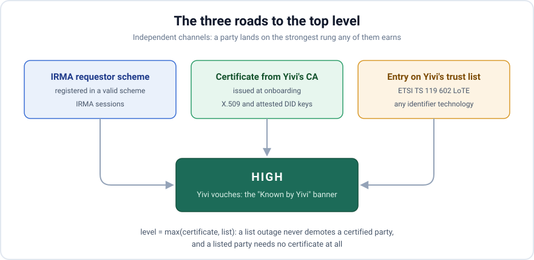

*A first look at the new trust system coming to the Yivi wallet: the ways an issuer or verifier can prove who it is, why a valid signature is not the same as a party you should trust, how the EU's new ETSI TS 119 602 trust lists became our backbone, and what it will take to earn the wallet's top trust level.*

<!-- truncate -->

## Every session starts with a stranger

A wallet has one job that is easy to state and hard to do well: help you share verified data about yourself, with the right party, and with nobody else. The cryptography behind that first part is in good shape. Signatures check out, certificate chains validate, credentials cannot be forged or tampered with. But cryptography answers the question *is this message authentic* — it says nothing about the question that actually decides whether you are safe: *should you be talking to this party at all?*

For the person holding the phone, trust is not a chain validation result. It is the confidence that when the app says "the Chamber of Commerce asks for your name and date of birth", it really is the Chamber of Commerce, and that someone accountable stands behind that claim. Every disclosure and every issuance starts with a party the wallet has to size up on your behalf, and the wallet needs a principled way to do it.

That is the question this post is about:

> **Who vouches for this party?**

Everything that follows — the identifier technologies, the ETSI standards, the trust levels — is that one question, made mechanical. It is also a preview: the trust system described in this post is new, and will land in the Yivi wallet in an upcoming release.

## Trust by scheme: how IRMA answers it today

The IRMA side of Yivi has always had an answer to this question, and a strict one: **schemes**. An IRMA wallet only accepts credentials from issuers registered in the IRMA scheme — a signed registry, curated by Yivi, that names every issuer, the credentials it may issue, and the keys it signs with. An issuer outside the scheme cannot issue at all. Verifiers live in a second registry, the **requestor scheme**: a registered verifier greets you with its vetted name and logo, while an unregistered one gets [a warning screen](https://docs.yivi.app/blog/2025-trusted-verifer) telling you to be careful. Trust, in the IRMA world, is a curated list with Yivi holding the pen.

That model works because IRMA is one ecosystem with one operator: every party can reasonably be asked to register with Yivi, so the vouching question always has one of two answers — Yivi does, or nobody does.

The EUDI wallet world is not like that. Under the **OpenID4VC** family of standards — OpenID4VCI for issuance, OpenID4VP for disclosure — the wallet meets issuers and verifiers that never signed up with Yivi and never will: parties from other ecosystems, other countries, other trust domains, authenticating with the technologies of the open world. The rest of this post is about how the wallet will size *them* up.

## The ways a party can prove who it is

When an issuer or verifier connects to the Yivi wallet over the OpenID stack, it authenticates in one of a handful of ways. They differ enormously in what they actually prove.

* **A certificate from Yivi's own CA.** The party went through Yivi's onboarding — vetting, a contract, and a certificate issued by the CA we operate ourselves. This is how today's trusted verifiers work. Yivi itself stands behind the party.
* **A certificate from a third-party CA we anchor.** An external, audited certificate authority — think of the qualified trust service providers of the eIDAS world — verified the party's legal identity and issued it a certificate. Somebody credible vouches for *who the party is*.
* **A certificate from a CA we do not know.** The chain does not trace to any root the wallet anchors. The wallet can verify the math, but the math ends nowhere. Evidentially this is the same as a self-signed key.
* **did:web.** The party publishes a DID document on its own domain. This proves control of that domain at the moment of resolution — roughly TLS-grade assurance — and everything in the document, including the display name, is self-asserted.
* **did:jwk.** The identifier *is* the public key, encoded into a string. There is no document, no domain, and nothing else. Anyone can mint one in a millisecond, for free.

## Valid is not the same as trustworthy

Each of these methods lets the wallet check a signature, but they differ sharply in whether anyone vouches for the party behind it. A certificate chain genuinely answers the vouching question — the CA at its root vouches for the subject it certified. The bare DID methods cannot even carry an answer. And even the certificate's answer, as we will see, is narrower than the question that decides whether you are safe.

Take `did:jwk`, which the DIIP interoperability profile (which Yivi supports) mandates alongside `did:web`. Because the key is the identifier, a `did:jwk` has three structural problems. It costs nothing to create, so a party that is denied or distrusted simply mints a new one. Rotating a key — routine security hygiene — silently creates a *different party*, breaking any trust that was attached to the old identifier. And since there is no DID document, there is no place to attach an attestation: no certificate can ever be bound to it. The identifier is also 176 characters long for a P-256 key, which rules out a human ever recognising one. A bare `did:web` is only slightly better: it proves domain control, and domains are cheap.

Certificates from real CAs are better still, but they answer a narrower question than it seems. An audited CA attests that a legal entity with a given name exists and controls this key. That is genuinely valuable — it is somebody vouching. But a real, registered legal name is not authorization. Fraud is routinely committed by real companies with real Chamber of Commerce registrations. Knowing *who a party is* does not tell the wallet whether that party has any business asking for your date of birth.

## The list the EU already asked for

What the wallet needs, then, is a layer on top of authentication: someone accountable stating, in a verifiable way, *we know this party, and we vouch for it*. We did not have to invent that layer, because the EU has been busy standardising exactly this. The Architecture and Reference Framework (ARF) that governs the European Digital Identity Wallet requires wallets to take their trust anchors from two ETSI list formats: the classic trusted lists of **ETSI TS 119 612**, and the new Lists of Trusted Entities of **ETSI TS 119 602**.

The two sound interchangeable and are not. In easy words:

> **TS 119 612 answers "who may vouch": it lists certificate authorities and trust services.
> TS 119 602 answers "who is vouched for": it lists the organisations themselves.**

TS 119 612 is the veteran. Since 2013 every member state has published an XML list of the trust services it supervises — the CAs allowed to issue qualified certificates — stitched together by an EU-level list of lists that is bootstrapped, charmingly, through the *Official Journal of the European Union*. It operates at the CA level: it can tell you that a certificate authority is legitimate, but it has nothing to say about the individual web shop or municipality holding one of that CA's certificates.

TS 119 602, published in late 2025, is the missing half. A **List of Trusted Entities (LoTE)** names *parties*: PID providers, wallet providers, relying parties — organisations, not CAs. It comes in a JSON binding signed as a JWS, carries per-entry statuses and service types, has sequence numbers and expiry built in, and the European Commission already publishes several such lists on the eIDAS dashboard. Crucially for us, the ARF explicitly allows ecosystems that issue non-qualified attestations to operate their *own* LoTE — which is precisely the space Yivi occupies.

So Yivi will publish a LoTE: a signed, regularly refreshed, machine-readable list of the parties Yivi vouches for, in the EU's own format.

Why only TS 119 602 for now, and not 119 612? Because the wallet's runtime question is the party-level one. The CA-level question — *which roots do we trust at all* — we answer at build time, by pinning a curated set of anchors into the wallet (a set that national 119 612 lists help us curate). Consuming 119 612 at runtime would mean XML signature validation for an answer we do not need mid-session, while the 119 602 JSON binding verifies with the exact machinery the wallet already uses for credentials. One list format does the runtime work; the other informs what we bake in.

### One party administration, two lists

This should sound familiar by now: a signed, Yivi-curated registry of parties is exactly what the requestor scheme has been all along. The LoTE is not a competitor to it; it is the same party administration, projected into a second world. One onboarding will produce a scheme entry for IRMA sessions and a LoTE entry for OpenID sessions. Same vetting, same off-boarding, two list formats speaking to two protocol stacks.

## Three levels, and a gate before the ladder

With authentication methods on one axis and vouching on the other, the trust system itself becomes simple. Every party the wallet talks to will land on one of three levels:

  

    
High

    
<strong>Yivi vouches.</strong> Registration in a valid IRMA scheme, a certificate under the Yivi CA, or an entry on Yivi's own trust list — whatever the party's identifier technology.

  

  

    
Medium

    
<strong>Somebody else vouches.</strong> A certificate under an audited CA that Yivi anchors but does not operate, and no entry on Yivi's list.

  

  

    
Low

    
<strong>Nobody vouches.</strong> A key with no attestation the wallet can verify and no list entry: a bare DID, or a certificate from a CA we do not anchor.

  

Three levels and not five, because a trust indicator is only useful if each state changes what the user should *do*. More gradations than that is decoration.

:::warning A failed check is not a low level

The ladder only ranks parties whose identity **checks out**. A party the wallet cannot authenticate at all — a broken signature, an unresolvable DID, a certificate chain that fails validation — never gets a level. The session ends with an error and nothing is shared. "Low" means *legitimate-looking but unknown*; it never means *broken*.

:::

And if the wallet cannot obtain a fresh, validly signed copy of the trust list? Then missing evidence is simply absent vouching: parties will rank by their certificates alone, sessions will keep working, and nobody gets upgraded by an outage.

Here is the full picture of the new system — every way of authenticating, crossed with whether Yivi's list names the party:

  <table className="tl-matrix">
    <thead>
      <tr>
        <th>How the party authenticates</th>
        <th>Not on Yivi's list</th>
        <th>On Yivi's list</th>
        <th>Why</th>
      </tr>
    </thead>
    <tbody>
      <tr>
        <td>IRMA requestor or issuerregistered in a valid scheme</td>
        <td>High</td>
        <td>Not applicable</td>
        <td className="tl-note">IRMA parties are never on the LoTE — the requestor scheme <em>is</em> their list, and it is a projection of the same party administration. Scheme registration already is Yivi's word.</td>
      </tr>
      <tr>
        <td>X.509 → Yivi's own CAcertificate chain to the Yivi root</td>
        <td>High</td>
        <td>High</td>
        <td className="tl-note">Yivi issued the certificate, so Yivi vouches. A list entry cannot raise this further.</td>
      </tr>
      <tr>
        <td>X.509 → anchored third-party CAan audited CA Yivi does not operate</td>
        <td>Medium</td>
        <td>High</td>
        <td className="tl-note">An external CA attested the legal name — that is somebody vouching, but not Yivi. The list entry is what adds Yivi's word.</td>
      </tr>
      <tr>
        <td>X.509 → unknown CAany root the wallet does not anchor</td>
        <td>Low</td>
        <td>High</td>
        <td className="tl-note">A chain the wallet cannot trace to any anchor proves nothing, so the certificate's contents count as self-asserted and the floor is low.</td>
      </tr>
      <tr>
        <td>did:web with an attested keycertificate carried inside the DID document</td>
        <td>Medium or High</td>
        <td>High</td>
        <td className="tl-note">Identical evidence to a certificate-authenticated party; only the transport differs. The certificate decides which rung.</td>
      </tr>
      <tr>
        <td>did:web, bareDID document on a domain, self-asserted name</td>
        <td>Low</td>
        <td>High</td>
        <td className="tl-note">Nothing attests a legal entity, so the list is the only thing that can speak for this party — and Yivi's word is Yivi's word, whatever the identifier technology.</td>
      </tr>
      <tr>
        <td>did:jwkkey embedded in the identifier — no document exists</td>
        <td>Low</td>
        <td>High</td>
        <td className="tl-note">No DID document means no certificate can ever be attached — the certificate channel is permanently silent, and the list is the whole story.</td>
      </tr>
    </tbody>
  </table>

Read down the right-hand column and you see the design: every party Yivi lists reaches high, and the only distinctions left are between kinds of *unlisted* party, where the certificate channel decides everything.

## What you will see in the app — and why that part will change

The levels will translate to the screen roughly like this:

| Level | What the app will do at launch |
|---|---|
| **Low** | A clear warning, consent that is never the default choice, and a name and logo that are only self-asserted. |
| **Medium** | Still a warning that the party is not known by Yivi, but with the organisation name attested by its CA. |
| **High** | The normal flow, with the "Known by Yivi" banner. |

There is an important split hiding in that table. The **levels are the fixed part** of the system: what each level means, and what evidence earns it, is designed not to change. What the app *does* with a level — the warnings, the defaults, what is allowed at all — is **policy**, and policy will evolve. At launch, a low-trust verifier can still run a session, behind a warning. We may later decide that unknown verifiers are off by default, and that users who want them must explicitly allow low-trust parties in the settings. The EU is moving in the same direction: under the eIDAS implementing rules taking effect at the end of 2026, wallets are expected to refuse credentials from issuers that cannot be authenticated at all. The trust levels are the dial that lets us — and coming regulation — tighten behaviour over time without rebuilding anything.

## The top rung, and the banner that depends on it

Why will the "Known by Yivi" banner require high, and not medium? Because the banner is not information, it is a *promise* — and it is Yivi making it. A user who sees it will reasonably relax. From a safety standpoint that means the banner must be backed by something Yivi can actually stand behind: a vetting process we ran, a contract we can enforce, an off-boarding path we control. Medium is real vouching, but it is somebody else's — an external CA attesting a name tells you who the party is, not that Yivi will answer for them. Reserving the banner for high keeps the promise honest.

The three roads to high are deliberately independent, and a party lands on the strongest rung any channel earns it — `level = max(certificate, list)`. A list outage can never demote a party holding a Yivi certificate, and a party with no certificate at all — even a bare `did:jwk` — reaches high through a list entry alone. Being listed *is* being onboarded: Yivi cannot name a party on its list without vouching for it.

The same ladder will measure **issuers** too — but the bar for the banner will not be the same there, and the difference is the user-safety logic again. Disclosure is the irreversible act: data shared with the wrong verifier is out, and nobody can take it back. Issuance flows the other way — nothing about you leaves the wallet, and a credential from an issuer you do not want can simply be deleted. So while the verifier banner demands high, we intend to set the issuer banner at medium: for *receiving* credentials, an issuer vouched for by an audited CA is trustworthy enough, even without Yivi's own vetting. Same fixed levels, different policy per role — exactly the kind of dial this system is designed to be.

## Third-party CAs: vouching, delegated

The matrix above places third-party CAs at medium, and at launch that will be the whole story. The roadmap goes one step further: we intend to anchor external CAs under *contractual agreements*, and the agreement determines the level their certificates confer. The reasoning follows directly from the vouching model. A CA's level is the level of its onboarding bar. If a CA contractually vets its subjects to the same standard as Yivi's own onboarding — and accepts liability for it — then trusting its certificates at high *is* Yivi vouching, delegated. A CA with a lighter regime anchors at medium.

And the escape hatch is built into the design: an individual party under a medium-tier CA that needs the top rung does not need a new certificate. It gets an entry on Yivi's LoTE, and `max(certificate, list)` does the rest.

## What the trust system deliberately does not solve

One thing this system unfortunately cannot do — and we looked — is answer the question users ask most often during disclosure: *"I do not have this credential yet. Where do I get it?"* It would be natural if the wallet could point at the issuer's website the moment a verifier asks for something missing.

The reason it cannot is an axis mismatch. The entire trust system — the ladder, the list, the certificates — is keyed by **party**: it answers "who vouches for this organisation". The obtain-flow needs the reverse lookup, keyed by **credential type**: "who issues this kind of credential, and at which URL". The ETSI list format has no field for that, and adding one would turn a trust statement into a discovery service with very different freshness and governance needs. It is no accident that the IRMA world *can* do this: the IRMA scheme happens to be both things at once — a party registry *and* a credential catalog with issuance URLs. For the OpenID stack, a credential catalog is a separate piece of infrastructure, and a story for another post.

## Getting vouched for

The new trust levels will arrive in an upcoming release of the Yivi app. What they boil down to is one question, asked on your behalf every session: *who vouches for this party?* Nobody — low, and the wallet will warn you. Somebody credible — medium, and the wallet will say so. Yivi itself — high, and the wallet will show it.

If you are running a verifier — or an issuer — and you would rather have your users greeted by your verified name than by a warning screen, that last rung is where you want to be, and getting there is a conversation away: reach us at [support@yivi.app](mailto:support@yivi.app).

## Sources

* [ETSI TS 119 602 V1.1.1 — Lists of Trusted Entities](https://www.etsi.org/deliver/etsi_ts/119600_119699/119602/01.01.01_60/ts_119602v010101p.pdf)
* [ETSI TS 119 612 V2.4.1 — Trusted Lists](https://www.etsi.org/deliver/etsi_ts/119600_119699/119612/02.04.01_60/ts_119612v020401p.pdf)
* [EUDI Architecture and Reference Framework — Trust Model](https://eudi.dev/3.0.0/main/06-trust-model/)
* [Commission Implementing Regulation (EU) 2025/848 on the registration of wallet-relying parties](https://eur-lex.europa.eu/legal-content/EN/TXT/?uri=CELEX:32025R0848)
* [eIDAS Dashboard — Lists of Trusted Entities](https://eidas.ec.europa.eu/efda/wallet/lists-of-trusted-entities/wallet-providers)
* [DIIP — the Decentralized Identity Interop Profile](https://fidescommunity.github.io/DIIP/)
* [Release of Trusted Verifier, Yivi blog](https://docs.yivi.app/blog/2025-trusted-verifer)
