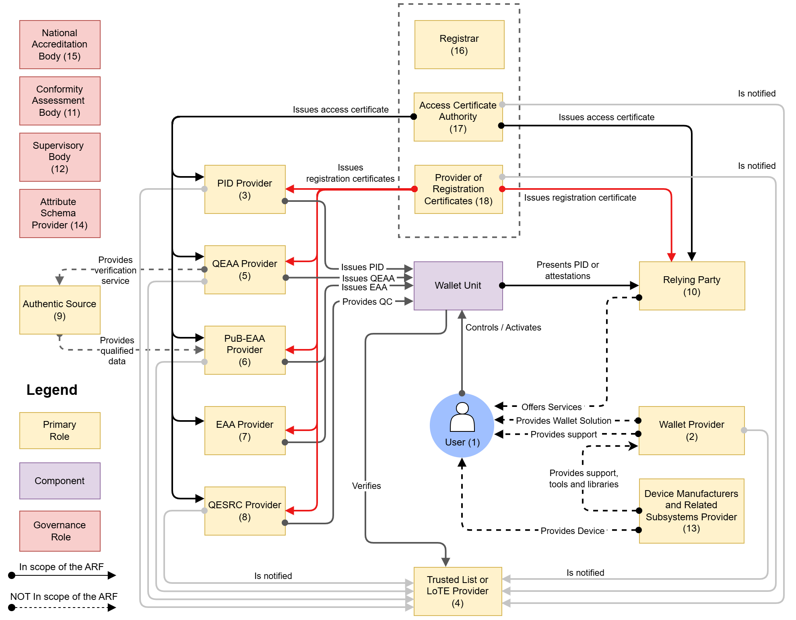

*The EUDI wallet ecosystem is being built for Level of Assurance "high", which means resistance against attackers with a high attack potential, up to and including state actors. Yet almost every cryptographic mechanism it standardises on today, from the signatures on your credentials to the TLS between its servers, is exactly the kind of asymmetric cryptography that a large quantum computer breaks. This post is about that gap, and about why "we will get to it later" is a harder position to defend for a high-assurance wallet than for almost any other system on the internet.*

<!-- truncate -->

## "Only God knows if encryption is really safe"

That is the translated title of a recent episode of the Dutch podcast [De Technoloog](https://www.bnr.nl/podcast/de-technoloog/10609122/alleen-god-weet-of-encryptie-echt-veilig-is), with cryptographer **Bas Westerbaan** as its guest. Westerbaan is a Radboud University alumnus, from the same Nijmegen cryptography school that [IRMA](https://www.irmalliance.org/), and therefore Yivi, grew out of. He now works at [Cloudflare](https://blog.cloudflare.com/author/bas-westerbaan/), where he spends his days actually shipping post-quantum cryptography to a meaningful fraction of the internet. Listening to him lay out the state of the field is a useful antidote to the way quantum risk is usually discussed. It is not a distant science-fiction event. It is an engineering migration that is already underway and is going to take the better part of a decade.

  <iframe title="De Technoloog on Spotify" src="https://open.spotify.com/embed/show/6koTehR7m7gptOv3tILVk1" style={{ borderRadius: '12px' }} frameBorder="0" allowFullScreen allow="clipboard-write; encrypted-media; fullscreen; picture-in-picture" loading="lazy"></iframe>

The uncomfortable part, for anyone building in the European digital identity space, is what that timeline implies. The [EU Digital Identity (EUDI) wallet ecosystem](https://eudi.dev/3.0.0/main/) is being assembled right now, on standards that are being finalised over the coming years, and those standards are almost without exception classical. If we finish building this ecosystem on the cryptography we have today, we will have to tear a great deal of it open again the moment we take post-quantum seriously. For a Level of Assurance "high" system, that moment should arrive sooner than for almost anything else.

## Two clocks that do not line up

Cloudflare is about as well positioned as an organisation can be to migrate to post-quantum cryptography. It controls both ends of a huge share of the connections it serves, it can ship changes to its edge continuously, and it has some of the best cryptographers in the world on staff. Even so, its stated goal is to be [fully post-quantum secure by 2029](https://blog.cloudflare.com/post-quantum-roadmap/), covering both key agreement and signatures, and that is described as an ambitious target. Key agreement is largely done: a majority of Cloudflare's traffic already uses hybrid [ML-KEM key exchange](https://blog.cloudflare.com/post-quantum-for-all/), and the company has extended the same approach into [post-quantum IPsec tunnels](https://blog.cloudflare.com/post-quantum-ipsec/). Signatures, the harder half, are the reason 2029 is a stretch rather than a done deal.

Now put the EUDI clock next to it. The ecosystem is aiming to reach production maturity over the next couple of years. The interoperability profiles, the trust frameworks and the certificate policies that member states and wallet providers implement against are being written now, and they are classical. If everything goes to plan, we roll out a continent-scale, high-assurance identity ecosystem built entirely on pre-quantum cryptography at roughly the same moment Cloudflare is congratulating itself on finishing the opposite migration. And then we would need to start overhauling the freshly built EUDI stack immediately to make it quantum resistant.

Two clocks, and they do not line up.

## What a quantum computer actually puts at risk

Before drilling into credentials and certificates, it is worth asking a blunt question: which of the wallet's cryptography is exposed, and in what way? Not all of it is threatened the same way. The standard way to reason about post-quantum risk, set out in [NIST's transition guidance](https://csrc.nist.gov/pubs/ir/8547/ipd), is to split cryptographic uses into two categories, **confidentiality** and **authentication**, because a quantum computer threatens them very differently. That split is a useful lens. It is also where the most expensive misjudgements about the EUDI wallet tend to hide.

**Confidentiality carries a retroactive risk, known as "harvest now, decrypt later".** An adversary can record encrypted traffic today and simply keep it until a quantum computer exists, then decrypt it. The exposure is fixed at the moment of capture, so anything protected only by classical encryption today can be opened the day that machine appears, however far off that is. In the wallet ecosystem the confidentiality surface is large: the (mutual) TLS that carries PID and attribute disclosures between wallet, issuers, verifiers and the wallet provider; the encrypted OpenID4VP responses that carry disclosed attributes to a verifier; the issuance channel; the wallet-to-provider messaging; and anything stored encrypted at rest. The payload underneath is identity data that never changes and is of obvious value to a state-level collector. Every such disclosure made today is one that can be reopened later.

**Authentication looks like the lower risk, and that is the trap.** A signature whose only job is to prove something in the moment is not exposed retroactively: nothing recorded today lets an attacker forge a new authentication tomorrow, so there is no harvest-now pressure. NIST's guidance reflects this, allowing quantum-vulnerable algorithms to keep being used for such cases until a quantum computer actually exists. This is the reasoning behind treating the wallet as low-risk, and Eric Verheul applies it carefully to the HSM-based wallet in his [SECDSA analysis](https://wellet.nl/SECDSA-EUDI-wallet-latest.pdf). The problem is that only a few of the wallet's signatures are genuinely momentary.

<table className="pq-table">
<thead>
<tr><th>Where the wallet uses crypto</th><th>Kind</th><th>What a quantum computer exposes</th></tr>
</thead>
<tbody>
<tr>
<th scope="row">Transport (mutual) TLS carrying PID</th>
<td>Confidentiality</td>
<td>Traffic recorded today can be decrypted once a quantum computer exists</td>
</tr>
<tr>
<th scope="row">OpenID4VP response encryption</th>
<td>Confidentiality</td>
<td>Disclosed attributes recorded today can be decrypted later</td>
</tr>
<tr>
<th scope="row">Wallet-to-provider messaging, data at rest</th>
<td>Confidentiality</td>
<td>Captured or stored ciphertext can be opened later</td>
</tr>
<tr>
<th scope="row">Holder binding, session authentication</th>
<td>Authentication, momentary</td>
<td>Can be forged, but only in real time and only once a quantum computer exists</td>
</tr>
<tr>
<th scope="row">Issuer signatures on credentials</th>
<td>Signature, credential lifetime</td>
<td>Credentials become forgeable for as long as they stay valid</td>
</tr>
<tr>
<th scope="row">Access and registration certs, trust lists</th>
<td>Signature, multi-year</td>
<td>Authorisation and trust anchors can be forged wholesale</td>
</tr>
<tr>
<th scope="row">Qualified electronic signatures</th>
<td>Signature, long-term legal</td>
<td>Doubt reaches back over documents signed years earlier</td>
</tr>
</tbody>
</table>

The risks all come from getting that split wrong:

- **Under-protecting confidentiality because the wallet is "an authentication device".** The framing invites treating the whole system as low-risk, while its transport and response-encryption layers are prime harvest-now targets for long-lived identity data. This is the biggest and most overlooked exposure.
- **Treating long-lived signatures as if they were momentary.** Issuer signatures live as long as the credential, access certificates and trust lists live for years and anchor everyone else, and a qualified electronic signature has to stay unforgeable for the legal life of a document. Once a quantum computer can forge them, every one of these already in the field is in question at once, and for qualified signatures the doubt reaches back over documents signed long before.
- **Confidentiality and authentication ride the same protocols.** TLS bundles key exchange with certificate authentication, and OpenID4VP bundles response encryption with request and response signing. The key exchange that protects confidentiality and the signatures that provide authentication can be broken independently, which leaves a channel where one half is exposed while the other still looks fine.

The distinction is a useful lens on exposure, but it does not license filing most of the wallet under "authentication, and therefore later". The next two sections look at that signature surface, in the credentials and in the PKI, and neither turns out to be as momentary as the label suggests.

## Aspect 1: credentials are asymmetric signatures, all the way down

Start with the thing the wallet exists to carry: credentials.

A EUDI credential, whether an SD-JWT VC or an ISO mdoc, is fundamentally a set of attributes with an **issuer's digital signature** over them. That signature is what makes the credential trustworthy. It is how a verifier knows the PID came from a member state's identity provider and was not fabricated. There is a second signature in the flow too: the **holder binding** or device key that proves the wallet presenting the credential is the one it was issued to.

Both of those are asymmetric signatures, and the [OpenID4VC High Assurance Interoperability Profile (HAIP)](https://openid.net/specs/openid4vc-high-assurance-interoperability-profile-1_0-final.html) is explicit about which ones. Its baseline is `ES256`, meaning ECDSA over the NIST P-256 curve with SHA-256, required across issuers, verifiers and wallets, with `ECDH-ES` over P-256 for response encryption. These are excellent classical choices. They are also precisely the primitives that [Shor's algorithm](https://en.wikipedia.org/wiki/Shor%27s_algorithm) dismantles on a cryptographically relevant quantum computer. Search the HAIP specification, or the underlying [OpenID4VCI](https://openid.net/specs/openid-4-verifiable-credential-issuance-1_0.html) and [OpenID4VP](https://openid.net/specs/openid-4-verifiable-presentations-1_0.html) specifications, for "post-quantum" and you will find nothing at all.

The threat here is not abstract. If an adversary can forge an issuer signature, they can mint credentials that are cryptographically indistinguishable from genuine ones: a synthetic PID for anyone they like, accepted by every verifier in the ecosystem. Credentials are also long lived. A document issued today may be valid for years, and the issuer keys behind them for longer still. A migration that "starts when quantum arrives" starts too late for anything already in the field.

And then there is the part I will deliberately not dwell on, because it deserves its own post: **zero-knowledge proofs**. Yivi's heritage, and the privacy-preserving future everyone claims to want for the EUDI wallet, leans on unlinkable, selective-disclosure proofs. The classical building blocks for those, such as [BBS+](https://www.ietf.org/archive/id/draft-irtf-cfrg-bbs-signatures-08.html) and the IRMA/Idemix family, are elegant and mature. Their post-quantum equivalents are not. Lattice-based zero-knowledge is an active research area, not a stable, standardised, certifiable toolbox you can ship to millions of phones. So the moment credentials go post-quantum, the privacy properties we have spent years perfecting have no drop-in replacement waiting for them. That is a gap on top of a gap, and it is worth naming even while we focus elsewhere.

## Aspect 2: the PKI nobody puts on the slides

Credentials get the attention. The plumbing does not, and the plumbing is where most of the asymmetric cryptography in the ecosystem actually lives.

Think about everything that has to hold a key pair for the EUDI wallet to function:

- **Issuer certificates**, chaining to the trust anchors published by member states, that let a wallet decide an issuer is authorised to issue what it issues.
- **Relying-party and access certificates**, the registration certificates that authorise a verifier to ask for specific attributes, which form the backbone of the whole "who is allowed to request what" model.
- **Wallet and key attestations** proving a wallet instance is genuine and that its keys live in secure hardware.
- **The (mutual) TLS** between every component: wallet to issuer, wallet to verifier, the backend-to-backend traffic, and the trust-list distribution.

Every one of those is RSA or elliptic curve today. Every one of those falls to the same quantum adversary. Making the EUDI wallet post-quantum is therefore not a matter of swapping the credential signature algorithm. It is re-issuing an entire continental PKI, redefining certificate profiles, and negotiating new cipher suites on every channel. That is a migration of the same shape and size as the one Cloudflare has been grinding through for years, except spread across dozens of member states and hundreds of trust service providers who all have to move roughly in step.

The transport layer also carries the classic **"harvest now, decrypt later"** risk, and this is exactly the case the European guidance flags. An adversary can record encrypted PID traffic today and decrypt it once a quantum computer exists. The [ECCG Agreed Cryptographic Mechanisms](https://certification.enisa.europa.eu/document/download/a845662b-aee0-484e-9191-890c4cfa7aaa_en?filename=ECCG%20Agreed%20Cryptographic%20Mechanisms%20version%202.pdf) document is blunt about it, and recommends prioritising post-quantum protection first "in applications where confidentiality is to be protected in the long term." Identity data, meaning who you are, where you live, your date of birth, and the fact that you presented a credential to a particular verifier at a particular time, is about as long-lived a confidentiality requirement as exists.

## What "post-quantum ready" would actually require

The good news is that Europe has already written down the destination. The [ECCG Agreed Cryptographic Mechanisms v2.0](https://certification.enisa.europa.eu/document/download/a845662b-aee0-484e-9191-890c4cfa7aaa_en?filename=ECCG%20Agreed%20Cryptographic%20Mechanisms%20version%202.pdf) (April 2025), the reference for what counts as "agreed" cryptography under the EU certification framework, already lists the post-quantum mechanisms an EUDI stack would migrate to:

<table className="pq-table">
<thead>
<tr><th>Purpose</th><th>Classical (today, HAIP)</th><th>Post-quantum (ECCG agreed)</th></tr>
</thead>
<tbody>
<tr>
<td>Signatures credentials, certificates, attestations</td>
<td><code className="pq-broken">ECDSA P-256 (ES256)</code>, RSA</td>
<td><a href="https://csrc.nist.gov/pubs/fips/204/final"><code className="pq-safe">ML-DSA</code></a> (FIPS 204, use ML-DSA-87 or -65), <a href="https://csrc.nist.gov/pubs/fips/205/final"><code className="pq-safe">SLH-DSA</code></a> (FIPS 205, levels 3 and 5), and stateful hash-based <a href="https://csrc.nist.gov/pubs/sp/800/208/final"><code>XMSS</code> / <code>LMS</code></a> (SP 800-208)</td>
</tr>
<tr>
<td>Key agreement / encryption TLS, response encryption</td>
<td><code className="pq-broken">ECDH P-256</code>, RSA</td>
<td><a href="https://csrc.nist.gov/pubs/fips/203/final"><code className="pq-safe">ML-KEM</code></a> (FIPS 203, use ML-KEM-1024 or -768), <a href="https://frodokem.org/"><code className="pq-safe">FrodoKEM</code></a> (-1344 or -976)</td>
</tr>
</tbody>
</table>

Two things about that table matter more than the algorithm names.

First, the ECCG does not tell you to simply replace the classical primitive with the post-quantum one. For the lattice-based mechanisms (ML-DSA, ML-KEM) it mandates **hybridisation**. They "shouldn't be used in a standalone way", but combined with a well-established classical mechanism, such that an attacker must break both to win. This is a hedge against the newer schemes turning out to have flaws. It is sensible, but it also means the migration target is heavier and more complex than today's stack, not a clean swap. Only the conservative hash-based signatures (SLH-DSA, XMSS, LMS) may stand alone.

Second, notice what is not on the post-quantum side: any zero-knowledge or anonymous-credential scheme. The agreed list gives us quantum-resistant signatures and key agreement. It does not give us quantum-resistant selective disclosure. Which brings us back to the ZKP gap: the ecosystem can go post-quantum for authenticity and confidentiality well before it can go post-quantum without sacrificing privacy.

And even the parts that are covered are not free. As Cloudflare put it in [ML-DSA will have to do](https://blog.cloudflare.com/ml-dsa-will-have-to-do/), "you go to war with the algorithms you have, not the ones you wish you had." ML-DSA is deployable today, but the parameter sets the ECCG agrees to are the large ones: an ML-DSA-65 signature is around 3,309 bytes against Ed25519's 64, with a 1,952-byte public key, and ML-DSA-87 is 4,627 and 2,592 bytes. Multiply that across every credential, every certificate in a chain, and every attestation in a presentation, and the size and performance budget of the whole protocol changes. The signature schemes that would ease that pain, such as FN-DSA, SQIsign and the multivariate candidates, are by NIST's own timelines standardised somewhere between 2027 and the early 2030s, and widely available even later. For the EUDI window, ML-DSA and SLH-DSA are what there is.

## Hybridisation is not a config flag: what it does to the protocols

The single most consequential line in the ECCG guidance is the hybridisation requirement, and it is worth taking seriously at the protocol level, because it sounds like a footnote and behaves like a redesign. The document is explicit that this is the recommended approach:

> The approach recommended in this document is to prioritize mitigating the quantum threat in applications where confidentiality is to be protected in the long term, by rolling out post-quantum secure cryptography in hybrid mode alongside existing classically secure asymmetric cryptography and/or symmetric keying. These hybrid modes shall ensure that all combined pre or post-quantum cryptographic mechanisms need to be broken simultaneously for the hybrid mode to be broken.
>
> *ECCG Agreed Cryptographic Mechanisms v2.0, section 1.4*

For signatures the rule means carrying two signatures and accepting only if both verify. For key agreement it means combining a post-quantum KEM with a classical one through a key combiner.

Now look at where the OpenID4VC stack actually keeps its cryptography.

A credential today carries **one** signature. An [SD-JWT VC](https://datatracker.ietf.org/doc/draft-ietf-oauth-sd-jwt-vc/) is a JWS in compact serialization: one `alg` header, one signature. An ISO mdoc is a `COSE_Sign1` structure: again, one signer. The compact and `COSE_Sign1` forms are, structurally, single-signature containers. A hybrid credential has to hold `ES256` **and** ML-DSA at once, and there are only two honest ways to do that. Either define a single **composite** algorithm identifier that internally concatenates both signatures, mirroring the [IETF LAMPS composite-signature work](https://datatracker.ietf.org/doc/draft-ietf-lamps-pq-composite-sigs/) being done for X.509 and CMS, and register it in the JOSE and COSE algorithm registries. Or abandon compact serialization for a multi-signature form, which breaks the tilde-delimited shape that SD-JWT VC and its selective-disclosure machinery depend on. Neither exists in HAIP, OpenID4VCI, OpenID4VP or the SD-JWT VC draft today.

There is a subtlety here that makes "just check two signatures" the wrong mental model. The ECCG describes the signature construction in exactly these terms:

> For digital signatures, hybridization can consist in concatenating signatures from different schemes, the verification function accepting if and only if all signatures are correct.
>
> *ECCG Agreed Cryptographic Mechanisms v2.0, section 5.2*

That "if and only if all signatures are correct" is doing a lot of work. Hybrid verification has to be **atomic**: a verifier that understands only the classical half, and silently ignores the post-quantum half, must not be able to accept. Otherwise the whole point is lost to a downgrade. That is exactly why the composite approach binds both signatures under one algorithm identifier that a verifier either fully supports or fully rejects. "Accept only if both hold" has to be one indivisible operation, not two optional checks that an implementation can quietly reduce to one.

The **holder-binding** signature doubles the difficulty. In SD-JWT VC the holder signs a Key Binding JWT, and in mdoc the device produces a device signature, both with a key that lives in the phone's secure element. A hybrid holder binding means that secure element has to generate an ML-DSA signature alongside the classical one, in hardware that today, in most shipping devices, cannot do it at all.

Encryption is a slightly happier story, but only slightly. HAIP mandates `ECDH-ES` over P-256 for encrypted OpenID4VP responses. Making that hybrid means combining ML-KEM with the classical ECDH through a key combiner, which again needs new hybrid key-agreement identifiers in JOSE and COSE that no profile mandates yet. The one genuinely mature piece is the **transport**: hybrid key exchange in TLS, such as `X25519MLKEM768`, is already shipping in browsers and CDNs (the [IETF TLS hybrid design](https://datatracker.ietf.org/doc/draft-ietf-tls-hybrid-design/) and Cloudflare's rollout), so the (mutual) TLS channel can go hybrid with comparatively little ceremony. The application-layer encryption inside OpenID4VP cannot ride on that TLS work; it is its own problem.

<table className="pq-table">
<thead>
<tr><th>Where the crypto lives</th><th>Today</th><th>What hybridisation demands</th><th>Status</th></tr>
</thead>
<tbody>
<tr>
<th scope="row">SD-JWT VC, issuer signature</th>
<td>JWS compact, single <code>ES256</code></td>
<td>Two signatures, or one composite <code>alg</code>, verified atomically</td>
<td>Undefined</td>
</tr>
<tr>
<th scope="row">SD-JWT VC / mdoc, holder binding</th>
<td>KB-JWT or device <code>COSE_Sign1</code>, holder key</td>
<td>Hybrid signature generated inside the secure element</td>
<td>Undefined + hardware-limited</td>
</tr>
<tr>
<th scope="row">ISO mdoc, issuer auth</th>
<td>Single-signer <code>COSE_Sign1</code></td>
<td>Composite COSE algorithm identifier</td>
<td>Undefined</td>
</tr>
<tr>
<th scope="row">OpenID4VP response encryption</th>
<td>JWE, <code>ECDH-ES</code> over P-256</td>
<td>ML-KEM combined with ECDH via a key combiner</td>
<td>Undefined</td>
</tr>
<tr>
<th scope="row">OpenID4VCI proof of possession</th>
<td>Proof JWT, holder key, <code>ES256</code></td>
<td>Hybrid proof signature and negotiated algorithms</td>
<td>Undefined</td>
</tr>
<tr>
<th scope="row">Transport (mutual) TLS</th>
<td>Classical ECDHE</td>
<td>Hybrid ML-KEM key exchange (<code>X25519MLKEM768</code>)</td>
<td>Shipping</td>
</tr>
</tbody>
</table>

Two cross-cutting effects sit underneath that table. The first is **size**. Hybrid means classical plus post-quantum, added together: an ML-DSA-65 signature of roughly 3.3 KB carried next to a 64-byte ECDSA one, in every credential, every proof and every presentation. For the QR-initiated and NFC or Bluetooth mdoc flows this runs straight into QR-code density and message-size limits, and selective disclosure, with its many per-claim digests, only compounds it. The second is **negotiation**. Every layer of OpenID4VC agrees on algorithms through metadata: the issuer advertises proof signing algorithms in OpenID4VCI, the verifier advertises supported algorithms in OpenID4VP. Hybrid means new algorithm values that every party has to publish, recognise and agree on, and since HAIP currently pins `ES256`, the profile itself has to be reopened to allow them.

So the hybridisation sentence in the ECCG document is not a switch to flip once the algorithms are ready. It reaches into the credential data model, the serialization, the secure element, the size budget and the negotiation metadata of OpenID4VCI, OpenID4VP and both credential formats at once. It has to be designed in, and none of these specifications define it yet.

## Who this actually lands on: the EUDI roles in the blast radius

It is tempting to treat "go post-quantum" as one project. The [ARF's model of the ecosystem](https://eudi.dev/3.0.0/main/03-roles-within-the-eudi-wallet-ecosystem/#roles-introduction) makes clear that it is not. It is a coordinated migration across roughly twenty distinct roles, each holding its own keys, certificates and certification obligations, and each of which has to move for the whole to be secure. The figure below is the ARF's own overview of those roles. The analysis after it groups them by how directly the quantum threat lands on them.

<figure className="pq-fig">

<figcaption>Figure 1, "Overview of the EUDI Wallet ecosystem roles and components", from the <a href="https://eudi.dev/3.0.0/main/03-roles-within-the-eudi-wallet-ecosystem/">EU Digital Identity Wallet Architecture and Reference Framework</a>. The numbers below refer to the roles as labelled here.</figcaption>

</figure>

Read through the lens of cryptography, those roles fall into a handful of layers, and they do not carry equal weight. The ones that mint signatures everyone else trusts, and the ones bound to hardware, have the longest lead times and therefore have to move first.

<table className="pq-table">
<thead>
<tr><th>Layer</th><th>Roles</th><th>Asymmetric crypto in their hands</th><th>Priority</th></tr>
</thead>
<tbody>
<tr>
<th scope="row">Trust anchors and PKI</th>
<td>Access Certificate Authority (17), Provider of Registration Certificates (18), Trusted List / LoTE Provider (4), Registrar (16)</td>
<td>The root and issuing keys, and the certificate and trusted-list signatures, that every other party chains up to. If these can be forged, the entire trust fabric can be too.</td>
<td>Move first</td>
</tr>
<tr>
<th scope="row">Credential issuers</th>
<td>PID Provider (3), QEAA Provider (5), PuB-EAA Provider (6), EAA Provider (7), QESRC Provider (8)</td>
<td>Issuer signing keys over PIDs and attestations (`ES256` today). QESRC additionally creates qualified signatures that must stay valid for the long term, exactly where "harvest now" bites hardest.</td>
<td>Heavy</td>
</tr>
<tr>
<th scope="row">Wallet and device</th>
<td>Wallet Provider (2), Wallet Unit, Device Manufacturers and Subsystems (13)</td>
<td>Wallet attestation keys and the holder-binding / device keys held in the secure element. Post-quantum signing has to happen inside that secure hardware.</td>
<td>Move first</td>
</tr>
<tr>
<th scope="row">Relying parties</th>
<td>Relying Party (10), its Relying Party Instances, and Intermediaries</td>
<td>Access certificates, registration certificates, (mutual) TLS, and verification of every issuer and trust-chain signature they receive.</td>
<td>Heavy</td>
</tr>
<tr>
<th scope="row">Governance and assurance</th>
<td>Conformity Assessment Body (11), Supervisory Body (12), National Accreditation Body (15), Attestation Scheme Provider (14)</td>
<td>None directly, but they define and certify what counts as acceptable cryptography for everyone above.</td>
<td>The gate</td>
</tr>
</tbody>
</table>

Two roles sit slightly outside this crypto blast radius. The **User (1)** does not manage any of these keys, but feels the migration through re-issuance of credentials and through larger, slower attestations. The **Authentic Source (9)** mostly feeds data into issuers rather than signing anything the wallet checks, so it is largely spared.

The uncomfortable part is the ordering. The two layers marked "move first" are the ones with multi-year lead times. Certificate authorities cannot simply flip an algorithm: they have to re-key roots, redefine certificate profiles, and re-issue down entire chains, all while old and new coexist. Secure-element hardware is worse still, because post-quantum signatures such as ML-DSA are heavy, and a large share of the secure elements shipping in phones today cannot generate them at all. That is a silicon roadmap problem, measured in device generations, not a software release.

And none of it ships until the governance layer moves. The Conformity Assessment Bodies, Supervisory Bodies and scheme owners have to rewrite certification criteria and rulebooks to first allow, and eventually require, post-quantum and hybrid mechanisms. Re-certification is the real gate: until the criteria change, a wallet provider that wants to be post-quantum ready cannot be certified for it. That is precisely why the moment to bake crypto-agility into every one of these roles is now, while the ecosystem is still being stood up, rather than after twenty categories of party have each hardened around classical cryptography.

## Level of Assurance "high" changes the risk calculus

Here is the argument I most want to land.

Most organisations plan their post-quantum migration against a **risk profile**. When is a cryptographically relevant quantum computer plausible? How long does my data need to stay confidential? How valuable is it to an attacker? For a great many systems, the honest answer is "we have some time", and a measured, later migration is entirely defensible.

The EUDI wallet does not get to reason that way, because of the assurance level it is designed for. eIDAS defines Level of Assurance **high** as, in essence, resistance to attackers with a **high attack potential**, meaning adversaries with substantial expertise, resources and motivation. In the standard threat-modelling language, that explicitly includes **nation-state actors**. That is the bar a EUDI wallet claims to clear.

Now ask the obvious question. Who is most likely to field a cryptographically relevant quantum computer first, and to harvest encrypted identity traffic today in anticipation of it? The same well-resourced state actors that Level of Assurance high is defined against. The quantum adversary is not some new threat outside the model. It is the flagship member of the exact threat class the wallet already promises to withstand. A risk-based "we will do post-quantum later" posture is coherent for a loyalty-card app. For a system whose entire assurance claim rests on beating high-attack-potential adversaries, deferring post-quantum protection is in tension with the assurance level printed on the box.

None of this is an argument against building the EUDI wallet, and it is certainly not an argument for waiting. It is an argument for **crypto-agility from day one**, meaning the ability to swap signature and key-agreement algorithms without re-architecting the wallet, and for putting a hybrid post-quantum path on the roadmap now, while the certificate profiles and interoperability profiles are still being written, rather than after they have hardened across dozens of member states. It is a great deal cheaper to leave room for ML-DSA and ML-KEM in a design than to retrofit them into a deployed one.

We have been building Yivi toward exactly that kind of agility. [Yivi 8.0 was framed around a crypto-agile foundation](/blog/2026-yivi-8-0-crypto-agility) precisely so that the algorithms underneath our credentials are things we can change rather than things we are stuck with. The EUDI ecosystem as a whole will need the same instinct. Because only God knows whether today's encryption is really safe forever, but we already know it is not safe against a large quantum computer, and we already know who is most motivated to build one.

## Sources and further reading

**Podcast**

- [De Technoloog (BNR): "Alleen God weet of encryptie echt veilig is", with Bas Westerbaan](https://www.bnr.nl/podcast/de-technoloog/10609122/alleen-god-weet-of-encryptie-echt-veilig-is)

**Standards and specifications**

- [OpenID4VC High Assurance Interoperability Profile (HAIP) 1.0 (final)](https://openid.net/specs/openid4vc-high-assurance-interoperability-profile-1_0-final.html)
- [OpenID for Verifiable Credential Issuance (OpenID4VCI)](https://openid.net/specs/openid-4-verifiable-credential-issuance-1_0.html)
- [OpenID for Verifiable Presentations (OpenID4VP)](https://openid.net/specs/openid-4-verifiable-presentations-1_0.html)
- [EU Digital Identity Wallet Architecture and Reference Framework (ARF)](https://eudi.dev/3.0.0/main/)
- [ARF: roles within the EUDI Wallet ecosystem](https://eudi.dev/3.0.0/main/03-roles-within-the-eudi-wallet-ecosystem/)
- [SD-JWT-based Verifiable Credentials (SD-JWT VC)](https://datatracker.ietf.org/doc/draft-ietf-oauth-sd-jwt-vc/)
- [BBS Signatures (IRTF CFRG draft)](https://www.ietf.org/archive/id/draft-irtf-cfrg-bbs-signatures-08.html)
- [Composite ML-DSA signatures (IETF LAMPS)](https://datatracker.ietf.org/doc/draft-ietf-lamps-pq-composite-sigs/)
- [Hybrid key exchange in TLS 1.3 (IETF TLS)](https://datatracker.ietf.org/doc/draft-ietf-tls-hybrid-design/)

**European cryptographic guidance**

- [ECCG Agreed Cryptographic Mechanisms v2.0 (April 2025, ENISA)](https://certification.enisa.europa.eu/document/download/a845662b-aee0-484e-9191-890c4cfa7aaa_en?filename=ECCG%20Agreed%20Cryptographic%20Mechanisms%20version%202.pdf)

**Transition guidance and analysis**

- [NIST IR 8547: Transition to Post-Quantum Cryptography Standards (initial public draft)](https://csrc.nist.gov/pubs/ir/8547/ipd)
- [Eric Verheul, SECDSA and the HSM-based EUDI wallet (appendix C on the PQC transition)](https://wellet.nl/SECDSA-EUDI-wallet-latest.pdf)

**Post-quantum algorithm standards**

- [FIPS 203: ML-KEM (Module-Lattice-Based Key-Encapsulation Mechanism)](https://csrc.nist.gov/pubs/fips/203/final)
- [FIPS 204: ML-DSA (Module-Lattice-Based Digital Signature Algorithm)](https://csrc.nist.gov/pubs/fips/204/final)
- [FIPS 205: SLH-DSA (Stateless Hash-Based Digital Signature Algorithm)](https://csrc.nist.gov/pubs/fips/205/final)
- [SP 800-208: Stateful Hash-Based Signature Schemes (XMSS / LMS)](https://csrc.nist.gov/pubs/sp/800/208/final)
- [FrodoKEM](https://frodokem.org/)

**Cloudflare on the post-quantum migration**

- [The post-quantum state of the internet in 2024 and our roadmap](https://blog.cloudflare.com/post-quantum-roadmap/)
- [ML-DSA will have to do](https://blog.cloudflare.com/ml-dsa-will-have-to-do/)
- [Post-quantum cryptography for all](https://blog.cloudflare.com/post-quantum-for-all/)
- [Post-quantum IPsec](https://blog.cloudflare.com/post-quantum-ipsec/)
- [Bas Westerbaan on the Cloudflare blog](https://blog.cloudflare.com/author/bas-westerbaan/)

**Background**

- [Shor's algorithm](https://en.wikipedia.org/wiki/Shor%27s_algorithm)
- [IRMA / Yivi](https://www.irmalliance.org/)
