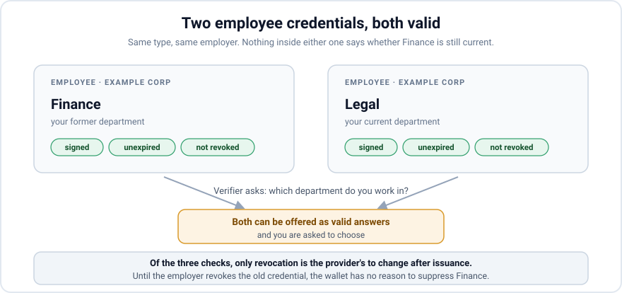
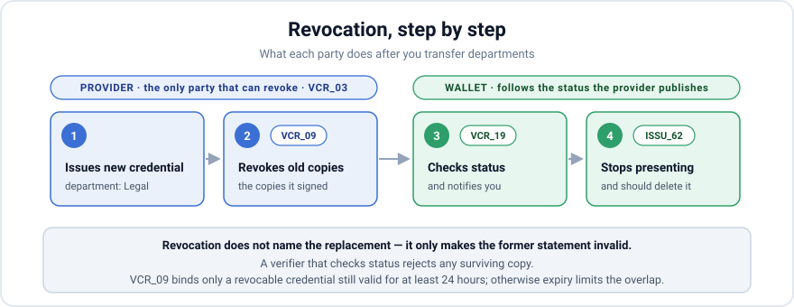

*An issuer knows when a credential has become obsolete. This post explains why revocation should drive replacement, and why Yivi should only infer it during an automatic background refresh.*

<!-- truncate -->

## You change departments

You transfer from Finance to Legal. Your employer issues a fresh employee credential with your new department. That is exactly what should happen.

Your wallet now holds two employee credentials. One says Finance; the other says Legal. The old credential is still signed, unexpired, and not revoked.

The next time a verifier asks for your department, the wallet may offer both. Your employer has left Finance valid, so the wallet has no authoritative reason to suppress it.

This is an issuer-side failure. The employer knows which credential contains your former department. When it issues the updated credential, it should revoke the obsolete one.

:::warning Replacement starts with the issuer

The ARF assigns complementary jobs. [`VCR_03`][vcr-03] makes the PID or attestation provider the only ecosystem party responsible for executing revocation.

Under [`VCR_09`][vcr-09], that provider revokes an applicable credential after its attributes change. Under [`VCR_19`][vcr-19], the wallet should regularly check status and notify the user.

:::

## Replacement hides two mechanisms

Here, a **logical credential** is the unit shown to the user as one card: one credential type from one provider with one set of attribute values.

Behind that card, the wallet may store several signed technical copies. Their salts, keys, signatures, and validity timestamps may differ, but each makes the same statement.

When attribute values change, the result is a new logical credential. The issuer determines whether an older credential remains valid by leaving it valid, letting it expire, or revoking it.

The wallet has a narrower decision when signed copies arrive during an automatic background refresh:

> **Do these copies refresh a logical credential already stored?**

The word *replacement* therefore covers two different mechanisms:

1. **Content identity** groups new technical copies with the same logical credential during refresh.
2. **Revocation status** tells wallets and verifiers that an old logical credential is no longer valid.

Content identity is calculated from the credential. Revocation is an issuer action on a credential it previously issued.

For a routine renewal, fresh copies refresh the stored batch. A second department may remain valid beside the first. After a transfer, the employer issues a new credential and revokes the old one.

## What content matching can decide

Yivi treats an arriving credential as another copy of a stored logical credential when three things match:

1. the **type** (`vct` for SD-JWT VC, `docType` for mdoc),
2. the **issuer**,
3. the **attribute values**.

The wallet hashes those inputs. If the hash matches, the new batch can refresh the stored batch. If it differs, the result is a different logical credential.

The hash omits salts, digests, holder keys, signatures, and validity timestamps. Those values change between issuances, even when the logical credential does not.

The ARF describes the same rule in a note attached to [`PAD_02`][pad-02]:

> Physical PIDs or attestations correspond to a logical one if they have not only the same attestation type and **Provider**, but also the same attribute values.

Type, provider, and attribute values: the same three inputs.

This works well for automatic background refresh. Credentials expire, and batches of single-use copies run out. The wallet fetches fresh copies with new keys and timestamps but unchanged attributes.

An age credential, for example, keeps saying `age_over_18: true`. Its hash still matches, so the fresh copies refresh the old batch and the wallet shows one card rather than twelve.

In an ordinary issuance, content identity may help group duplicates. It must not decide that a different logical credential has become obsolete. Only the issuer can make that decision through revocation.

OpenID4VCI describes the alternative plainly: a wallet may end up with several credentials of the same type "without knowing which one is the latest".

## Why type and issuer both matter

The type says what kind of credential this is. It does not identify the subject or issuer. Every credential of that type shares its claim structure.

In SD-JWT VC, the type is the `vct` claim, usually an HTTPS URL. In mdoc, it is the `docType`, such as `org.iso.18013.5.1.mDL`. Either way, it names a kind, not one person's credential.

The issuer says who stands behind the claims. That identity is not always a single field; the wallet derives it differently by format:

* **SD-JWT VC** carries an `iss` claim, and when it is present that is the answer. When it is absent, the issuer is whoever the certificate that signed the credential names.
* **mdoc** has no issuer field in the document whatsoever. Issuer identity lives entirely in the certificate chain the document was signed under.
* When neither yields a usable name, what is left is the credential issuer URL from the issuance protocol — the endpoint the wallet fetched the credential from.

Consider two `age_verification` credentials that both say `age_over_18: true`. One comes from the Dutch state and one from a supermarket loyalty programme.

They are different statements. A verifier may accept one issuer and refuse the other. Merging the credentials would discard the source of their authority, as the [trust levels post](/blog/who-vouches-for-you) explains.

It would also create a security problem because refreshing a batch deletes its stored copies and holder-binding keys.

Without the issuer in the hash, copies from one issuer could be grouped with another issuer's credential. If that grouping replaced the old batch, a hostile issuer could delete it without even guessing the values.

The rule therefore depends on a stable issuer identity. If a domain changes, a certificate uses a different name, or a trailing slash appears, a renewal gets a new hash. The wallet then stores it beside the old batch.

This is the mirror image of the department problem: one logical credential fails to be recognized as itself. Both failures reveal the absence of a durable identity across issuances.

The credential issuer URL is the weakest fallback. It names the endpoint used to fetch a credential, which need not be the entity that signed it. Treating that URL as identity is a Yivi limitation rather than a specification gap.

SD-JWT VC also treats shifting issuer identifiers as a tracking risk for verifiers to notice. An issuer name that changes is not routine churn that a wallet can safely normalize away.

## Why the wallet must not guess

Issuer identity prevents different issuers from being grouped together. Attribute values distinguish logical credentials from the same issuer.

Changed attributes still leave the wallet unable to decide whether an older credential remains valid.

  

    
You join a second department

    <dl>
      <dt>Type</dt><dd>same as one you hold</dd>
      <dt>Issuer</dt><dd>same as one you hold</dd>
      <dt>Attributes</dt><dd><strong>differ</strong> from the stored credential</dd>
    </dl>
    
Issuer action: keep both valid

  

  

    
You transfer departments

    <dl>
      <dt>Type</dt><dd>same as one you hold</dd>
      <dt>Issuer</dt><dd>same as one you hold</dd>
      <dt>Attributes</dt><dd><strong>differ</strong> from the stored credential</dd>
    </dl>
    
Issuer action: revoke the old credential

  

Some employees work in both Finance and Legal. Joining a second department keeps the first credential valid. After a transfer, the employer revokes the credential for the former department.

The wallet observes the same pattern in both cases: same type, same issuer, different attributes. Only the issuer knows whether the older statement remains true.

Attribute names do not help. A field describes its value, not whether an older credential should remain valid. The wallet must follow credential status instead of inferring the issuer's intent.

The complete matrix makes the blind band visible:

  <table className="ci-matrix">
    <thead>
      <tr>
        <th>What really happened</th>
        <th>Type</th>
        <th>Issuer</th>
        <th>Attributes</th>
        <th>Required handling</th>
      </tr>
    </thead>
    <tbody>
      <tr>
        <th scope="row">PID renewed, nothing changed</th>
        <td>Same</td>
        <td>Same</td>
        <td>Same</td>
        <td>Refresh copies</td>
      </tr>
      <tr>
        <th scope="row">Email credential re-issued unchanged</th>
        <td>Same</td>
        <td>Same</td>
        <td>Same</td>
        <td>Refresh copies</td>
      </tr>
      <tr className="ci-blind">
        <th scope="row">You transfer departments</th>
        <td>Same</td>
        <td>Same</td>
        <td>Differ</td>
        <td>Revoke old</td>
      </tr>
      <tr className="ci-blind">
        <th scope="row">You join a second department</th>
        <td>Same</td>
        <td>Same</td>
        <td>Differ</td>
        <td>Keep both valid</td>
      </tr>
      <tr className="ci-blind">
        <th scope="row">A second diploma from the same university</th>
        <td>Same</td>
        <td>Same</td>
        <td>Differ</td>
        <td>Keep both valid</td>
      </tr>
      <tr>
        <th scope="row">Age credential from the state and from a shop</th>
        <td>Same</td>
        <td>Differ</td>
        <td>Same</td>
        <td>Keep both valid</td>
      </tr>
      <tr>
        <th scope="row">Email attested by your employer and by the state</th>
        <td>Same</td>
        <td>Differ</td>
        <td>Same</td>
        <td>Keep both valid</td>
      </tr>
    </tbody>
  </table>

Content identity handles technical refresh in the first two rows and keeps different issuers apart in the last two.

The middle three rows share one observable shape but require different issuer actions. A wallet cannot resolve **same type, same issuer, different attribute values** by inspecting content.

It should not try. The issuer must revoke the old credential when its statement is no longer true and leave it valid when both statements remain true.

## Revocation is the replacement signal

When changed values make an old credential obsolete, the provider should issue the updated credential and revoke the old one.

Under ARF [`VCR_09`][vcr-09], a provider must revoke a revocable PID or attestation when its attributes changed and it would otherwise remain valid for at least 24 hours.

The provider controls the status of the credentials it issued. It can invalidate the exact old technical copies without asking the wallet to infer a relationship from the contents of the new credential.

After revocation, the old copies are no longer valid. Under [`VCR_19`][vcr-19], the wallet should regularly check their status and notify the user if one is revoked.

Under [`ISSU_62`][issu-62], the wallet stops presenting the obsolete credential and should delete it. A verifier that checks status can reject any surviving copy.

Revocation does not name the replacement. It still solves the safety problem: the former statement is invalid, while the newly issued statement is valid.

[`ISSU_59`][issu-59] also requires the wallet to compare old and new values during re-issuance and notify the user. That comparison needs linked process context, such as an automatic background refresh.

It does not authorize the wallet to compare arbitrary credentials and decide which one the issuer meant to invalidate.

The `VCR_09` mandate applies when the credential is revocable and would remain valid for at least 24 hours. Otherwise, expiry limits the overlap. The wallet still cannot declare it invalid on the issuer's behalf.

## Issuance identifiers do not replace revocation

IRMA, the protocol Yivi grew out of, lets a credential type be marked as a singleton. The wallet then replaces every previous instance when another credential of that type arrives.

That is a wallet-side shortcut based on the type. It fails for diplomas, employee roles, and other types that may have one valid instance or several. Revocation targets the exact credential that became obsolete.

Several EUDI and OpenID4VCI identifiers also look like possible replacement signals, but each names either a type or one delivery:

**[`credential_configuration_id`][vci-terminology].** This describes a kind of credential offered by an issuer. Two email addresses and a corrected email address can all use the same configuration.

**[`credential_identifiers`][vci-token-response].** These can identify datasets, but only within the access token returned for that authorization. A later issuance cannot use them to refer back to a stored credential.

**[SD-JWT VC type metadata][sdjwt-type-metadata].** This describes a type's claims and presentation. It says nothing about how many instances a person may hold or whether one supersedes another.

**[`credential_reuse_policy`][issu-39]** (ARF `ISSU_39`, ETSI TS 119 472-3). This selects a reuse method. Related requirements define batch size and re-issuance timing. None relates two logical credentials.

**[The credential itself][sdjwt-registered-claims].** It has no stable credential identifier that survives re-issuance. The `sub` claim identifies the subject, not the credential.

The OpenID4VCI data model explains why none can carry the decision. A Credential Dataset is a set of claims about a subject. Both a department transfer and an additional department create a new dataset.

The model expresses no relationship between those datasets. Every available identifier names a **type** or a **delivery**, not a logical credential over time.

That absence does not make replacement a wallet decision. During ordinary issuance, the provider's revocation of the exact old credential is the authoritative signal that it became obsolete.

The missing relationship still matters for the before-and-after comparison in `ISSU_59`. It does not need to determine whether the old credential remains valid.

## Background refresh is the exception

The missing relationship can exist in the wallet's local issuance context even when neither the protocol nor the credential carries it.

OpenID4VCI lets a wallet obtain an updated credential with a valid access token, or by using a refresh token to obtain one.

For a device-bound PID or attestation, ARF [`ISSU_65`][issu-65] requires the provider to verify that the re-issued technical PID or attestation goes to the same Wallet Unit.

Neither the refresh mechanism nor `ISSU_65` identifies a particular stored credential as the predecessor. A refresh token is not, by itself, a stable pointer to one logical credential.

Yivi can still know more locally. If an automatic refresh starts from a stored credential and retains that association, it can carry “this issuance replaces credential X” through the session and use it during storage.

Today, Yivi discards that context and later tries to reconstruct it from the content hash. Content comparison cannot recover the association after it has been discarded.

This is the one path where Yivi can safely replace a local credential from process context. It knows which credential initiated the refresh rather than guessing from type, issuer, and attributes.

User-initiated issuance is different. A universal link, QR code, or link in an email starts an ordinary authorization with no stored credential attached.

The resulting credential carries no more context than a first-time issuance. In this path, the provider must revoke the obsolete credential. Yivi should store the new one and follow the status of the old one without guessing.

## If you issue credentials

Credential replacement starts with the issuer:

1. Issue the updated credential.
2. Revoke the obsolete technical copies when their claims are no longer true.
3. Support automatic refresh so the wallet can update its local record without interrupting the user.

Do not rely on matching type, issuer, or attributes to make a wallet invalidate an old credential. Those fields cannot distinguish a department transfer from an additional department.

Yivi should follow revocation status during ordinary issuance. Only an automatic background refresh may use its retained local association to replace the credential that initiated that refresh.

If a credential cannot be revoked, its validity period determines how long an obsolete value may remain usable. That is part of the issuer's credential design.

If you run an issuer and want to talk about how your re-issuance flow behaves, or you think we have this wrong, we would like to hear it: [support@yivi.app](mailto:support@yivi.app).

## Sources

* [OpenID for Verifiable Credential Issuance 1.0](https://openid.net/specs/openid-4-verifiable-credential-issuance-1_0-final.html) — Credential Configuration and Credential Dataset terminology, batch issuance, and refreshing issued credentials
* [EUDI Architecture and Reference Framework](https://github.com/eu-digital-identity-wallet/eudi-doc-architecture-and-reference-framework) — logical versus technical attestations, [`VCR_03`][vcr-03], [`VCR_09`][vcr-09], [`VCR_19`][vcr-19], [`ISSU_59`][issu-59], [`ISSU_62`][issu-62], [`ISSU_65`][issu-65], [`PAD_02`][pad-02]
* [ARF discussion topic B: re-issuance and batch issuance of PIDs and attestations](https://github.com/eu-digital-identity-wallet/eudi-doc-architecture-and-reference-framework/blob/main/docs/discussion-topics/b-re-issuance-and-batch-issuance-of-pids-and-attestations.md)
* [SD-JWT-based Verifiable Credentials](https://datatracker.ietf.org/doc/draft-ietf-oauth-sd-jwt-vc/) — type metadata and the issuer-identifier tracking considerations
* ETSI TS 119 472-3 — `credential_reuse_policy`
* [Who vouches for you? How the Yivi wallet will decide whom to trust](/blog/who-vouches-for-you)

[issu-39]: https://eudi.dev/3.0.0/annexes/annex-2/annex-2.03-high-level-requirements-by-category/#ISSU_39
[issu-59]: https://eudi.dev/3.0.0/annexes/annex-2/annex-2.03-high-level-requirements-by-category/#ISSU_59
[issu-62]: https://eudi.dev/3.0.0/annexes/annex-2/annex-2.03-high-level-requirements-by-category/#ISSU_62
[issu-65]: https://eudi.dev/3.0.0/annexes/annex-2/annex-2.03-high-level-requirements-by-category/#ISSU_65
[pad-02]: https://eudi.dev/3.0.0/annexes/annex-2/annex-2.03-high-level-requirements-by-category/#PAD_02
[vcr-03]: https://eudi.dev/3.0.0/annexes/annex-2/annex-2.03-high-level-requirements-by-category/#VCR_03
[vcr-09]: https://eudi.dev/3.0.0/annexes/annex-2/annex-2.03-high-level-requirements-by-category/#VCR_09
[vcr-19]: https://eudi.dev/3.0.0/annexes/annex-2/annex-2.03-high-level-requirements-by-category/#VCR_19
[vci-terminology]: https://openid.net/specs/openid-4-verifiable-credential-issuance-1_0-final.html#name-terminology
[vci-token-response]: https://openid.net/specs/openid-4-verifiable-credential-issuance-1_0-final.html#name-successful-token-response
[sdjwt-type-metadata]: https://datatracker.ietf.org/doc/html/draft-ietf-oauth-sd-jwt-vc#name-sd-jwt-vc-type-metadata
[sdjwt-registered-claims]: https://datatracker.ietf.org/doc/html/draft-ietf-oauth-sd-jwt-vc#name-registered-jwt-claims
