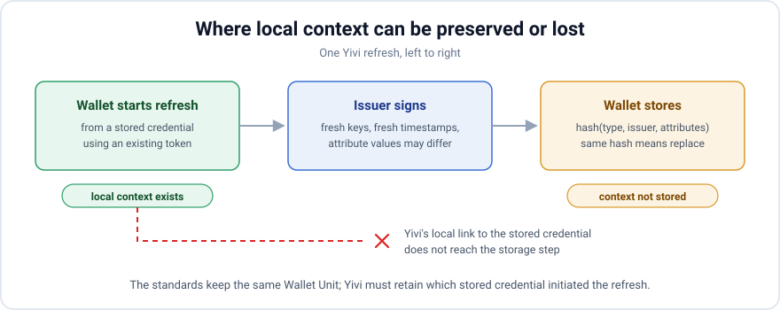

*Every new credential forces a wallet to decide what it replaces. This post explains Yivi's rule, why the issuer matters, and where today's specifications leave every wallet guessing.*

<!-- truncate -->

## You move house

You move house. A few weeks later, your PID provider issues a fresh PID with your new address. That is exactly what should happen.

Your wallet now holds two PIDs. One says Oude Gracht 1; the other says Nieuwe Gracht 5. Both are validly signed, neither has expired, and neither says which one is current.

The next time a verifier asks where you live, the wallet offers both. It presents your former address as an equally legitimate answer and asks you to choose.

The wallet is using all the information it received. The issuance simply did not say that the new PID supersedes the old one. Today's specifications provide no general way to say so.

:::warning An obsolete credential is more than clutter

These two cards are not interchangeable. One contains an address that is no longer true, yet the wallet offers both as equals until the old credential expires.

The ARF assigns this job to the wallet. `ISSU_62` says it SHALL stop presenting an obsolete credential and SHOULD delete it. But the wallet first needs to know which credential became obsolete.

:::

## One decision hides two questions

When a credential arrives, the wallet must make one practical decision:

> **Does this replace what I already hold?**

Answer *yes* incorrectly and the wallet deletes something you needed. Answer *no* incorrectly and it keeps an obsolete credential without telling you which one is current.

That decision hides two different questions:

1. Does it have the same **content identity** as a credential already stored?
2. Does it **supersede** a credential already stored?

Content identity is calculated from the credential itself. Supersession is a relationship between an old issuance and a new one.

For a routine renewal, both answers are *yes*. For a second email address, both are *no*. After a change of address, the answers are *no* and *yes*. That last combination is where wallets become blind.

## How the wallet decides today

Yivi treats an arriving credential as another copy of a stored logical credential when three things match:

1. the **type** (`vct` for SD-JWT VC, `docType` for mdoc),
2. the **issuer**,
3. the **attribute values**.

The wallet hashes those inputs. If the hash matches, the new batch replaces the stored batch. If it differs, the wallet keeps both.

The hash omits salts, digests, holder keys, signatures, and validity timestamps. Those values change between issuances, even when the logical credential does not.

The ARF describes the same rule in a note attached to `PAD_02`:

> Physical PIDs or attestations correspond to a logical one if they have not only the same attestation type and **Provider**, but also the same attribute values.

Type, provider, and attribute values: the same three inputs.

This works well for routine renewals. Credentials expire, and batches of single-use copies run out. The wallet returns to the issuer for fresh copies with new keys and timestamps but unchanged attributes.

An age credential, for example, keeps saying `age_over_18: true`. Its hash still matches, so the fresh copies replace the old ones and the wallet shows one card rather than twelve.

OpenID4VCI describes the alternative plainly: a wallet may end up with several credentials of the same type "without knowing which one is the latest".

## Why type and issuer both matter

The type says what kind of credential this is. It does not identify the subject or issuer. Every credential of that type shares its claim structure.

In SD-JWT VC, the type is the `vct` claim, usually an HTTPS URL. In mdoc, it is the `docType`, such as `org.iso.18013.5.1.mDL`. Either way, it names a kind, not one person's credential.

The issuer says who stands behind the claims. That identity is not always a single field; the wallet derives it differently by format:

* **SD-JWT VC** carries an `iss` claim, and when it is present that is the answer. When it is absent, the issuer is whoever the certificate that signed the credential names.
* **mdoc** has no issuer field in the document whatsoever. Issuer identity lives entirely in the certificate chain the document was signed under.
* When neither yields a usable name, what is left is the credential issuer URL from the issuance protocol — the endpoint the wallet fetched the credential from.

Consider two `age_verification` credentials that both say `age_over_18: true`. One comes from the Dutch state and one from a supermarket loyalty programme.

They are different statements. A verifier may accept one issuer and refuse the other. Merging the credentials would discard the source of their authority, as the [trust levels post](/blog/who-vouches-for-you) explains.

It would also create a security problem because replacement deletes every stored copy and holder-binding key in the old batch.

Without the issuer in the hash, any issuer could delete another issuer's credential by issuing the same type and attributes. For a one-boolean age credential, a hostile issuer would not even need to guess the values.

The rule therefore depends on a stable issuer identity. If a domain changes, a certificate uses a different name, or a trailing slash appears, a renewal gets a new hash. The wallet then stores it beside the old batch.

This is the mirror image of the address problem: one logical credential fails to be recognized as itself. Both failures reveal the absence of a durable identity across issuances.

The credential issuer URL is the weakest fallback. It names the endpoint used to fetch a credential, which need not be the entity that signed it. Treating that URL as identity is a Yivi limitation rather than a specification gap.

SD-JWT VC also treats shifting issuer identifiers as a tracking risk for verifiers to notice. An issuer name that changes is not routine churn that a wallet can safely normalize away.

## Where the rule becomes blind

Issuer identity prevents different issuers from overwriting each other. Attribute values distinguish many credentials from the same issuer. But changed attributes create one band where identity and replacement diverge.

  

    
You add a second email address

    <dl>
      <dt>Type</dt><dd>same as one you hold</dd>
      <dt>Issuer</dt><dd>same as one you hold</dd>
      <dt>Attributes</dt><dd><strong>differ</strong> from the stored credential</dd>
    </dl>
    
Correct answer: keep both

  

  

    
You move house

    <dl>
      <dt>Type</dt><dd>same as one you hold</dd>
      <dt>Issuer</dt><dd>same as one you hold</dd>
      <dt>Attributes</dt><dd><strong>differ</strong> from the stored credential</dd>
    </dl>
    
Correct answer: replace

  

You may hold valid credentials for both a personal and a work email address. Adding the second must keep the first. But after you move house, your old home address should be replaced.

The wallet observes the same pattern in both cases: same type, same issuer, different attributes. The correct outcomes are opposite.

Attribute names do not help. A field describes its value, not whether the new credential adds to or replaces one already stored. That relationship is absent from both credentials.

The complete matrix makes the blind band visible:

  <table className="ci-matrix">
    <thead>
      <tr>
        <th>What really happened</th>
        <th>Type</th>
        <th>Issuer</th>
        <th>Attributes</th>
        <th>Correct answer</th>
      </tr>
    </thead>
    <tbody>
      <tr>
        <th scope="row">PID renewed, nothing changed</th>
        <td>Same</td>
        <td>Same</td>
        <td>Same</td>
        <td>Replace</td>
      </tr>
      <tr>
        <th scope="row">Email credential re-issued unchanged</th>
        <td>Same</td>
        <td>Same</td>
        <td>Same</td>
        <td>Replace</td>
      </tr>
      <tr className="ci-blind">
        <th scope="row">You move house</th>
        <td>Same</td>
        <td>Same</td>
        <td>Differ</td>
        <td>Replace</td>
      </tr>
      <tr className="ci-blind">
        <th scope="row">You add a second email address</th>
        <td>Same</td>
        <td>Same</td>
        <td>Differ</td>
        <td>Keep both</td>
      </tr>
      <tr className="ci-blind">
        <th scope="row">A second diploma from the same university</th>
        <td>Same</td>
        <td>Same</td>
        <td>Differ</td>
        <td>Keep both</td>
      </tr>
      <tr>
        <th scope="row">Age credential from the state and from a shop</th>
        <td>Same</td>
        <td>Differ</td>
        <td>Same</td>
        <td>Keep both</td>
      </tr>
      <tr>
        <th scope="row">Email attested by your employer and by the state</th>
        <td>Same</td>
        <td>Differ</td>
        <td>Same</td>
        <td>Keep both</td>
      </tr>
    </tbody>
  </table>

Content identity handles the first two and last two rows correctly. Matching content replaces routine renewals; a different issuer keeps distinct claims apart.

The middle three rows share one observable shape but require different outcomes. With the current data model, no wallet can resolve **same type, same issuer, different attribute values** in every case.

## Why the credential cannot close the gap

IRMA, the protocol Yivi grew out of, has a partial answer. A credential type can be marked as a singleton, so issuing a new one replaces every previous instance of that type.

That handles types for which a person can hold only one credential. It fails for diplomas, addresses, and other types that may have one valid instance or several. The needed relationship belongs to the credential, not its type.

The EUDI specifications contain no such relationship. Several identifiers look promising, but each names either a type or one delivery:

**`credential_configuration_id`.** This describes a kind of credential offered by an issuer. Two email addresses and a corrected email address can all use the same configuration.

**`credential_identifiers`.** These can identify datasets, but only within the access token returned for that authorization. A later issuance cannot use them to refer back to a stored credential.

**SD-JWT VC type metadata.** This describes a type's claims and presentation. It says nothing about how many instances a person may hold or whether one supersedes another.

**`credential_reuse_policy`** (ARF `ISSU_39`, ETSI TS 119 472-3). This controls technical copies, batch size, and refresh triggers. It does not relate two logical credentials.

**The credential itself.** It has no stable credential identifier that survives re-issuance. The `sub` claim identifies the subject, not the credential.

The OpenID4VCI data model exposes the underlying problem. A Credential Dataset is a set of claims about a subject. Both a changed address and a second email address create a new dataset.

The model expresses no relationship between those datasets. It cannot say that one supersedes another. Every available identifier names a **type** or a **delivery**, not a logical credential over time.

Yet the ARF requires the missing behavior. `ISSU_62` says a wallet SHALL stop presenting an obsolete credential, while `ISSU_59` says it SHALL compare old and new values and notify the user.

Both requirements assume the wallet already knows which stored credential is the old one. The data model gives it no general way to know.

## The issuance sometimes carries the answer

The missing relationship can exist in the issuance context even when it is absent from the credential.

In a refresh, the wallet uses an existing token to fetch a new version of a credential it already holds. ARF `ISSU_65` requires the provider to return it to the same wallet unit.

The refresh begins with a specific stored credential. At that moment, the wallet knows what the result should replace. Today, Yivi loses that context and later tries to reconstruct it from the content hash.

Yivi can improve this path by carrying “this issuance replaces credential X” through the session and using it during storage. Content comparison cannot recover that information after it has been discarded.

User-initiated issuance is different. A universal link, QR code, or link in an email starts an ordinary authorization with no stored credential attached.

The resulting credential carries no more context than a first-time issuance. Someone requesting a new PID after moving house may use exactly this path, where the wallet has the least information.

## What the ecosystem still needs

The user-initiated case needs a durable way for an issuance to say **this supersedes that**. It must name a logical credential across sessions rather than a type or one delivery.

That is a small concept and a substantial change to a data model that has already shipped. Until it exists, every wallet must guess when type and issuer match but attributes differ.

## If you issue credentials

Issuers can already preserve the answer in one important case.

**When changed attributes require re-issuance, use the refresh path instead of starting a fresh authorization.** A refresh lets the wallet retain the identity of what is being replaced. A new authorization makes it guess.

Content identity remains the best fallback: it handles unchanged renewals and separates issuers correctly. In the blind band, preserving issuance context is the only reliable signal available today.

If you run an issuer and want to talk about how your re-issuance flow behaves, or you think we have this wrong, we would like to hear it: [support@yivi.app](mailto:support@yivi.app).

## Sources

* [OpenID for Verifiable Credential Issuance 1.0](https://openid.net/specs/openid-4-verifiable-credential-issuance-1_0.html) — Credential Configuration and Credential Dataset terminology, batch issuance, and refreshing issued credentials
* [EUDI Architecture and Reference Framework](https://github.com/eu-digital-identity-wallet/eudi-doc-architecture-and-reference-framework) — logical versus technical attestations, `ISSU_59`, `ISSU_62`, `ISSU_65`, `PAD_02`
* [ARF discussion topic B: re-issuance and batch issuance of PIDs and attestations](https://github.com/eu-digital-identity-wallet/eudi-doc-architecture-and-reference-framework/blob/main/docs/discussion-topics/b-re-issuance-and-batch-issuance-of-pids-and-attestations.md)
* [SD-JWT-based Verifiable Credentials](https://datatracker.ietf.org/doc/draft-ietf-oauth-sd-jwt-vc/) — type metadata and the issuer-identifier tracking considerations
* ETSI TS 119 472-3 — `credential_reuse_policy`
* [Who vouches for you? How the Yivi wallet will decide whom to trust](/blog/who-vouches-for-you)
