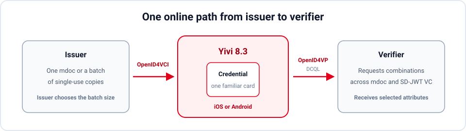

*Yivi app 8.3.0 is now available with end-to-end support for mdocs in online flows. An issuer can issue an mdoc into Yivi over OpenID4VCI, after which its holder can selectively disclose attributes from it to a verifier over OpenID4VP.*

<!-- truncate -->

## From issuer to verifier

With 8.3, mdocs follow Yivi's SD-JWT VC path: received and stored through OpenID4VCI (both pre-authorized code and authorization code flows are supported), then selectively presented through OpenID4VP.

This works in every build: iOS, Google Play, and F-Droid. The release concerns online presentation; proximity presentation over NFC or Bluetooth will follow later.

## One request, several ways to answer

OpenID4VP verifiers describe what they need using DCQL. Yivi 8.3 supports requests containing multiple required credentials as well as alternative combinations of credentials and attributes across mdoc and SD-JWT VC.

For example, a verifier asking for a full name and date of birth could accept a passport credential in mdoc format, a PID as an SD-JWT VC, or a Nijmegen personal-data SD-JWT VC originally issued through the IRMA protocol. Yivi evaluates the complete query against the credentials in the app and offers the combinations that satisfy it. An SD-JWT VC issued over IRMA can still be disclosed over OpenID4VP.

The user does not have to understand any of these formats. An mdoc works like any other credential in Yivi, with the same familiar card and consent screen. Only the requested attributes are included in the presentation.

## Batch issuance without batch-shaped UX

Yivi also supports OpenID4VCI batch issuance for mdocs. The issuer determines the batch size and can issue several copies of the same credential, intended to be used one by one. Using a fresh copy for each presentation reduces linkability between presentations.

Inside Yivi, the batch still appears as one credential. The app keeps track of the copies and selects an unused one when the user agrees to disclose attributes. The details stay out of the user's way.

We tested these flows against multiple issuer and verifier server implementations. The implementation targets [OpenID4VCI 1.0](https://openid.net/specs/openid-4-verifiable-credential-issuance-1_0.html), [OpenID4VP 1.0](https://openid.net/specs/openid-4-verifiable-presentations-1_0.html), and the [ISO/IEC 18013-5 mdoc format](https://www.iso.org/standard/69084.html).

## What comes next

This is another milestone on our road towards an [ARF-compliant EUDI Wallet](https://eudi.dev/latest/). The same mdoc issuance and presentation flows form part of the European Commission's latest [Age Verification Solution Technical Specification](https://docs.ageverification.dev/av-doc-technical-specification/). That specification includes [Longfellow ZK](https://datatracker.ietf.org/doc/draft-google-cfrg-libzk/) for zero-knowledge mdoc presentations. We plan to support it in a coming release, allowing Yivi to prove facts about mdoc attributes without revealing the underlying credential.

If you operate an issuer or verifier, you can start with our [OpenID4VCI issuer integration guide](/openid4vci-issuer-integration) and [OpenID4VP verifier integration guide](/openid4vp-verifier-integration). We would like to hear how Yivi works with your implementation at [support@yivi.app](mailto:support@yivi.app).
