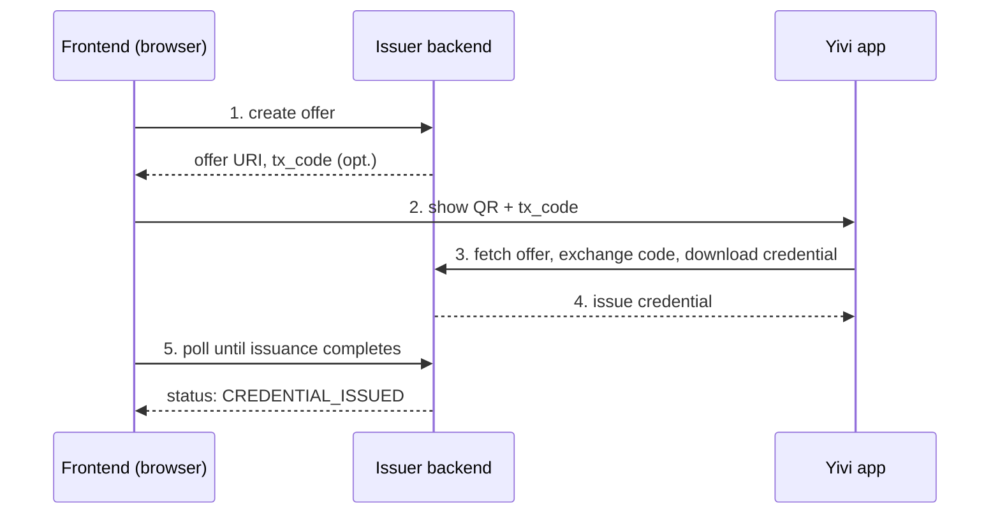

:::info Private Beta
OpenID4VCI issuance is currently in private beta. The endpoints, request shapes, and integration steps below describe the reference setup we use for demos and are subject to change.
:::

This guide walks through integrating a frontend with an OpenID4VCI-compatible issuer backend, using the pre-authorized code flow. The shape of the requests follows the reference implementation that ships with the [openid4vp-demo-frontend](https://github.com/privacybydesign/openid4vp-demo-frontend) repository (which also contains the verifier-side examples for [OpenID4VP](openid4vp-verifier-integration.md)).

## Architecture

The OpenID4VCI specification defines the **wallet↔issuer** interaction — the credential offer URI, the token endpoint, and the credential endpoint. It does **not** specify how a frontend talks to its own issuer backend to create offers or check their status. The diagram below therefore mixes two kinds of interactions: the standardized wallet↔issuer steps (3 and 4), and the frontend↔issuer steps (1, 2, and 5) which are specific to the reference issuer backend used in our demos. If you integrate with a different OpenID4VCI issuer, expect the frontend-facing parts to differ.



## Creating a credential offer

The frontend asks the issuer backend to create an offer for a specific credential type. The minimal payload below issues a pre-configured `EmailCredentialSdJwt` with one year of validity. As noted above, the request shape is specific to our reference issuer backend, not OpenID4VCI itself:

```ts
const offer = {
  credentials: ["EmailCredentialSdJwt"],
  grants: {
    "urn:ietf:params:oauth:grant-type:pre-authorized_code": {
      "pre-authorized_code": "generate",
    },
  },
  credentialMetadata: { expiration: 31_536_000 }, // seconds (1 year)
  credentialDataSupplierInput: {
    email: "alice@example.com",
    domain: "example.com",
  },
}

const response = await fetch(`${ISSUER_BASE}/${ISSUER_NAME}/api/create-offer`, {
  method: "POST",
  headers: {
    "Content-Type": "application/json",
    Authorization: `Bearer ${ISSUER_TOKEN}`,
  },
  body: JSON.stringify(offer),
})

const { id, uri } = await response.json()
```

The returned `uri` is the wallet link (typically `openid-credential-offer://?credential_offer_uri=...`). Render it as a QR code on desktop, or navigate to it directly on mobile.

## The optional tx_code

A `tx_code` adds an extra confirmation step: the issuer's frontend displays a short numeric code that the user must type into the wallet before the credential is downloaded. Useful when the offer is delivered out-of-band (email, printed letter) and you want to ensure the right person redeems it.

The example below extends the same reference-issuer offer shape introduced above; how a `tx_code` is requested and surfaced is therefore also reference-issuer-specific:

```ts
const offerWithTxCode = {
  ...offer,
  grants: {
    "urn:ietf:params:oauth:grant-type:pre-authorized_code": {
      "pre-authorized_code": "generate",
      tx_code: { input_mode: "numeric", length: 6 },
    },
  },
}
```

The issuer backend returns the generated code as `txCode` in the response — show it next to the QR so the user can copy it into the Yivi app.

## Polling for issuance completion

The Yivi app talks directly to the issuer over the OpenID4VCI HTTP endpoints; the frontend stays out of that loop and only watches for completion:

```ts
const id_ = setInterval(async () => {
  const result = await fetch(`${ISSUER_BASE}/${ISSUER_NAME}/api/check-offer`, {
    method: "POST",
    headers: {
      "Content-Type": "application/json",
      Authorization: `Bearer ${ISSUER_TOKEN}`,
    },
    body: JSON.stringify({ id }),
  })
  if (result.status !== 200) return

  const { status } = await result.json()
  if (status !== "CREDENTIAL_ISSUED") return

  clearInterval(id_)
  onIssuanceComplete()
}, 500)
```

Polling keeps the example minimal; what you use in production depends on your issuer setup.

## Where to go next

- [OpenID4VCI Introduction](openid4vci-introduction.md) — protocol overview, flow choice, scope of the private beta.
- [Issuing SD-JWT VC over IRMA](sdjwtvc-issuance.md) — the operational alternative for existing Yivi issuers.
- [openid4vp-demo-frontend](https://github.com/privacybydesign/openid4vp-demo-frontend) — the reference implementation (`src/issuers.ts` contains the full issuance example).
