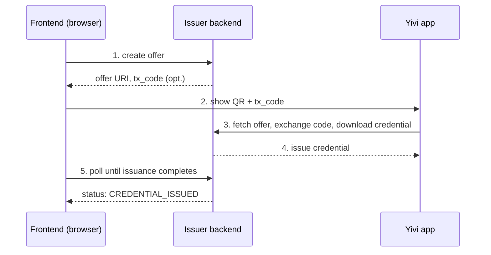

:::info Private Beta
OpenID4VCI issuance is currently in private beta. The endpoints, request shapes, and integration steps below describe the reference setup we use for demos and are subject to change.
:::

This guide walks through integrating a frontend with an OpenID4VCI-compatible issuer backend, using the pre-authorized code flow. The shape of the requests follows the reference implementation that ships with the [openid4vp-demo-frontend](https://github.com/privacybydesign/openid4vp-demo-frontend) repository (which also contains the verifier-side examples for [OpenID4VP](openid4vp-verifier-integration.md)).

## Architecture

The OpenID4VCI specification defines the **wallet↔issuer** interaction — the credential offer URI, the token endpoint, and the credential endpoint. It does **not** specify how a frontend talks to its own issuer backend to create offers or check their status. The diagram below therefore mixes two kinds of interactions: the standardized wallet↔issuer steps (3 and 4), and the frontend↔issuer steps (1, 2, and 5) which are specific to the reference issuer backend used in our demos. If you integrate with a different OpenID4VCI issuer, expect the frontend-facing parts to differ.


```mermaid
sequenceDiagram
    participant FE as Frontend (browser)
    participant BE as Issuer backend
    participant App as Yivi app

    FE->>BE: 1. create offer
    BE-->>FE: offer URI, tx_code (opt.)
    FE->>App: 2. show QR + tx_code
    App->>BE: 3. fetch offer, exchange code, download credential
    BE-->>App: 4. issue credential
    FE->>BE: 5. poll until issuance completes
    BE-->>FE: status: CREDENTIAL_ISSUED
```

## Creating a credential offer

The frontend asks the issuer backend to create an offer for a specific credential type. The minimal payload below issues a pre-configured `EmailCredentialSdJwt` with one year of validity. As noted above, the request shape is specific to our reference issuer backend, not OpenID4VCI itself:

```ts
const offer = {
  credentials: ["EmailCredentialSdJwt"],
  grants: {
    "urn:ietf:params:oauth:grant-type:pre-authorized_code": {
      "pre-authorized_code": "generate",
    },
  },
  credentialMetadata: { expiration: 31_536_000 }, // seconds (1 year)
  credentialDataSupplierInput: {
    email: "alice@example.com",
    domain: "example.com",
  },
}

const response = await fetch(`${ISSUER_BASE}/${ISSUER_NAME}/api/create-offer`, {
  method: "POST",
  headers: {
    "Content-Type": "application/json",
    Authorization: `Bearer ${ISSUER_TOKEN}`,
  },
  body: JSON.stringify(offer),
})

const { id, uri } = await response.json()
```

The returned `uri` is the wallet link (typically `openid-credential-offer://?credential_offer_uri=...`). Render it as a QR code on desktop, or navigate to it directly on mobile.

## Universal links (optional)

Any app on the device can claim the `openid-credential-offer://` scheme, so on a phone with multiple wallets the user sees a chooser sheet — and a hostile app could in principle register the same scheme. To make an offer deterministically open in the Yivi app, wrap the standard URI in a `https://open.yivi.app/-/openid-credential-offer` universal link. The OS verifies that host against Yivi's `apple-app-site-association` / `assetlinks.json`, so only Yivi can claim it.

The transform is mechanical: strip the scheme, prepend the universal-link host and path, keep the query string verbatim. No params are added, removed, reordered, or re-encoded.

```
openid-credential-offer://?credential_offer_uri=https://issuer.example/offer/123
    ↓
https://open.yivi.app/-/openid-credential-offer?credential_offer_uri=https://issuer.example/offer/123
```

Use `https://open.staging.yivi.app/-/openid-credential-offer` for staging. The custom scheme remains supported unchanged, so this is opt-in and only matters when you specifically want to bypass the wallet chooser.

## The optional tx_code

A `tx_code` adds an extra confirmation step: the issuer's frontend displays a short numeric code that the user must type into the wallet before the credential is downloaded. Useful when the offer is delivered out-of-band (email, printed letter) and you want to ensure the right person redeems it.

The example below extends the same reference-issuer offer shape introduced above; how a `tx_code` is requested and surfaced is therefore also reference-issuer-specific:

```ts
const offerWithTxCode = {
  ...offer,
  grants: {
    "urn:ietf:params:oauth:grant-type:pre-authorized_code": {
      "pre-authorized_code": "generate",
      tx_code: { input_mode: "numeric", length: 6 },
    },
  },
}
```

The issuer backend returns the generated code as `txCode` in the response — show it next to the QR so the user can copy it into the Yivi app.

## How the Yivi app picks a grant type

Unlike the two sections above, this part is not reference-issuer-specific: it is the wallet↔issuer contract from [OID4VCI v1.0 § 4.1.1](https://openid.net/specs/openid-4-verifiable-credential-issuance-1_0.html#name-credential-offer-parameters), and it applies to any issuer the Yivi app talks to. The app implements two grant type identifiers:

| Identifier | Flow |
| --- | --- |
| `urn:ietf:params:oauth:grant-type:pre-authorized_code` | Pre-authorized code |
| `authorization_code` | Authorization code |

When the offer's `grants` member names both, the app uses the pre-authorized code grant.

`pre-authorized_code` is REQUIRED inside a pre-authorized code grant. If your offer omits it or sends it as an empty string, the app rejects the offer while parsing it, before it contacts the token endpoint. A grant whose value is JSON `null` names no grant at all and is treated as absent.

If `grants` names only identifiers the app does not implement, the session fails and the error message lists what was offered. This is deliberate: naming a grant type states which grants the issuer is prepared to process for that offer.

### An offer without a grants member

`grants` is OPTIONAL. When it is absent, `null`, or an empty object, the app takes the grant type from the authorization server's `grant_types_supported` metadata instead:

```json
{
  "issuer": "https://as.example",
  "authorization_endpoint": "https://as.example/authorize",
  "token_endpoint": "https://as.example/token",
  "grant_types_supported": ["authorization_code"]
}
```

Three consequences to plan for:

- Only the authorization code grant can be derived. The pre-authorized code flow needs a `pre-authorized_code`, and only the offer can supply one, so an offer without `grants` can never start that flow.
- An authorization server that does not advertise `authorization_code` fails the session, with the error naming the grant types it does advertise. Omitting `grant_types_supported` entirely means `["authorization_code", "implicit"]` per [RFC 8414 § 2](https://www.rfc-editor.org/rfc/rfc8414.html#section-2), so the derivation still succeeds; an explicitly empty list means no grant type is supported and it does not.
- A derived grant carries no `issuer_state` and no `authorization_server` hint, because both are members of an offered grant. The app therefore uses the first entry of the credential issuer metadata's `authorization_servers`, or the credential issuer itself when that member is absent.

:::note Unreleased
Deriving the grant type from authorization server metadata, and rejecting an empty `pre-authorized_code` during parsing, landed in irmago after `v1.2.0` ([irmago#644](https://github.com/privacybydesign/irmago/pull/644)). On an app built against `v1.2.0` or earlier, an offer without a `grants` member crashes the app process rather than failing the session, and an empty `pre-authorized_code` is sent to the token endpoint as-is. Send an explicit, fully populated `grants` member until the app version you target ships that fix.
:::

## Polling for issuance completion

The Yivi app talks directly to the issuer over the OpenID4VCI HTTP endpoints; the frontend stays out of that loop and only watches for completion:

```ts
const id_ = setInterval(async () => {
  const result = await fetch(`${ISSUER_BASE}/${ISSUER_NAME}/api/check-offer`, {
    method: "POST",
    headers: {
      "Content-Type": "application/json",
      Authorization: `Bearer ${ISSUER_TOKEN}`,
    },
    body: JSON.stringify({ id }),
  })
  if (result.status !== 200) return

  const { status } = await result.json()
  if (status !== "CREDENTIAL_ISSUED") return

  clearInterval(id_)
  onIssuanceComplete()
}, 500)
```

Polling keeps the example minimal; what you use in production depends on your issuer setup.

## Where to go next

- [OpenID4VCI Introduction](openid4vci-introduction.md) — protocol overview, flow choice, scope of the private beta.
- [Issuing SD-JWT VC over IRMA](sdjwtvc-issuance.md) — the operational alternative for existing Yivi issuers.
- [openid4vp-demo-frontend](https://github.com/privacybydesign/openid4vp-demo-frontend) — the reference implementation (`src/issuers.ts` contains the full issuance example).
